# Pulse 1.1.0 — Test & Defect Report

**Application:** Pulse 1.1.0_TEST — Building Operations Platform
**Environment:** https://test.alt-pulse.com/
**Account under test:** Organization Admin (ALEC organization)
**Build marker (original):** `v1.1.0_TEST` · **Retest build:** `v1.1.2_TEST` (deployed 01 Jul 2026) · © 2026
**Prepared:** 2026-06-18 · **Retest:** 2026-07-01

This report combines three things in one document:

- **Part A — Automated test execution results** (cross-browser Playwright suite).
- **Part B — UI / rendering defect report** with reproduction steps and a screenshot embedded **below each defect** (desktop 1440×900 and mobile 390×844).
- **Part C — Live exploratory session** (Playwright MCP, authenticated): behavioural / data / integration defects found by walking every page live with console + network capture.
- **Part D — BMS operational & data-integrity findings**, cross-checked against the client QA workbook `Pulse_QA_Complete_v2.xlsx`, with the headline critical items re-verified live.

> **About the earlier "45".** That number came from the **first cross-browser suite run**, which produced **45 failing tests**. Investigation showed those were **test-side issues** (selectors and timing in the new specs), **not** application bugs — the same 45 failed identically on every browser. They were all fixed and the suite is now green (see Part A). The genuine **application** defects — the request's focus ("incorrect page rendering, buttons mismatch alignments") — are catalogued in **Part B** from an automated visual/DOM audit of all 19 pages.

---

# Retest — Build v1.1.2_TEST (01 Jul 2026)

The developer deployed **v1.1.2_TEST** (footer confirmed) with fixes for the items in their bug tracker and marked almost every defect **"Done."** Each verdict below was **re-verified live** (Playwright MCP, Org Admin) against the new build. Legend: ✅ **Fixed** · ❌ **Still open** · ◐ **Partial** · ↺ **Re-framed by design change** · ⏳ **Pending deeper/role-based retest**.

> **Headline:** the **Critical** logout defect is **NOT fixed**. `POST /api/user/refresh` still returns `500 "Organization is not defined"` (3/3), and forcing token expiry + reload still logs the user out to `/login` with tokens cleared — despite being marked "Done."

| Bug | Area | Dev claim | Retest verdict (v1.1.2) | Evidence |
|-----|------|-----------|-------------------------|----------|
| **BUG-030** | Auth — token refresh (**Critical**) | Done | ❌ **Still open** | `/api/user/refresh` → `500` ×3; forced expiry + reload → `/login`, tokens cleared |
| BUG-005 | Overview Map — AI modal auto-open | Done ("feature") | ✅ Fixed | No `z-[1100]` auto-modal on load |
| BUG-009 | Dashboard — blank building card | Done | ✅ Fixed | STRIVE Tent now real image; no `-- %` |
| BUG-012 | Overview Map — legend overflow | Done | ✅ Fixed | Equipment bar right = 1536 = viewport |
| BUG-029 | Alarm Details — badge overlaps X | Done | ✅ Fixed | Badge and X clearly separated |
| BUG-031 | Overview Map — zoom buttons covered | Done | ✅ Fixed | Zoom button is topmost (not covered) |
| BUG-032 | Dashboard — card hover jitter | Done | ✅ Fixed | Cards steady 460px on hover; grid-expand removed |
| BUG-033 | Asset Mgmt — Fire Alarm phantom | Done | ✅ Fixed | Fire Alarm chip = 0; card absent |
| BUG-037 | Overview Map — panel re-open | Done | ✅ Fixed | "Expand Portfolio Performance" toggle added |
| BUG-041 | HVAC Live — Ambient overlaps SUPPLY | Done | ✅ Fixed | Card bottom 378 clears SUPPLY top 381 (0 overlap) |
| BUG-042 | Chatbot — scroll chaining | Done | ✅ Fixed | `.chat-body` now `overscroll-behavior: contain` |
| BUG-004 | AI Reports — mobile overflow | Done | ✅ Fixed | No horizontal overflow @ 390px |
| BUG-013 | Energy — mobile overflow | Done | ✅ Fixed | No horizontal overflow @ 390px |
| BUG-035 | Notifications — header clipped @100% | Done | ❌ **Still open** | Header top −60px (above viewport) at 770px |
| BUG-036 | Global — building card font brightness | Done | ❌ **Still open** | Subtitle still `text-white/60` (unchanged) |
| BUG-008 | Asset Mgmt — truncated card titles | Done | ◐ Partial | Still truncated at rest ("Occupancy S…"); marquee-on-hover added |
| BUG-001 / 002 / 010 / 011 | Settings — mobile table/filter overflow | Done | ◐ Partial | No **page** overflow @ 390px, but email states "Settings responsive not started" — table internals need spot-check |
| BUG-021 / BUG-039 | RBAC data scope / hard-refresh scope | Done | ↺ Re-framed | Org Admin now sees **full org** (7 sites · 15 buildings · 1114 devices) on every load — the email states Org Admin should have full access, so this is now by design. **Real test:** create a *scoped* user and confirm they see only their scope (pending) |
| BUG-034 | Alarm JSON copy button | Done | ⏳ Pending | Sampled alarm had no Additional-Information JSON to test |
| BUG-003, 006, 007, 014–028 (rest of C), 038, 040 | Various | Done | ⏳ Pending | Re-verification in progress |
| BUG-020 | RBAC broken access control | Done | ⏳ Pending | Requires a non-admin role/user (RBAC phase) |
| WB-01 … WB-20 | BMS domain (Part D) | Mostly Done; WB-04/05/10/11/13 "Not yet Integrated" | ⏳ Pending | Domain/data re-verification phase |

**Retest so far:** **13 Fixed** ✅ · **3 Still open** ❌ (incl. 1 **Critical**) · **~6 Partial/Re-framed** · remainder **Pending** (RBAC role-based + BMS-domain phases). Full re-verification of the RBAC scenarios (the email's step 4) and the BMS/Part-D items is the next phase.

---

# Part A — Automated test execution results

**Tooling:** Playwright `@playwright/test` ^1.61.0 (TypeScript). One spec per module/dashboard/feature/page. Cross-browser projects **Chrome, Edge, Firefox, Brave**, plus anonymous, performance, tablet and mobile projects. Authenticated state is captured once by a `setup` project and reused.

### A.1 Latest suite status (full combined run — 2026-06-18)

A single combined run of **all projects across all four browsers** was executed (`node_modules/@playwright/test/cli.js test`, 6 workers, 1 retry). **Total 637 tests · 628 passed · 4 flaky (passed on retry) · 1 failed · 4 skipped** · wall-clock **18.4 min**.

| Result | Count | Notes |
|--------|------:|-------|
| ✅ Passed | 628 | All four browsers + anonymous, performance, tablet, mobile |
| 🔁 Flaky (passed on retry) | 4 | Live-data / first-paint timing, recovered on retry #1 |
| ❌ Failed | 1 | Live inventory loaded empty (`Buildings` text absent) — data-timing, not an app bug |
| ⏭ Skipped | 4 | Conditional (e.g. known-issue guard, environment-gated) |

**The 5 non-passing specs (1 failed + 4 flaky) — all test-side data/timing against the live server, not application defects:**

| # | Project | Spec | Symptom | Classification |
|---|---------|------|---------|----------------|
| 1 | edge | `core/asset-management.spec.ts:19` — BMS section & inventory summary | `expect(body).toMatch(/Buildings/i)` — live inventory loaded empty on this run | ❌ Failed (data-timing) |
| 2 | chrome | `operations/maintenance-calendar.spec.ts:13` — Integration Pending marker | heading not visible within timeout | 🔁 Flaky → passed on retry |
| 3 | chrome | `shell/navigation.spec.ts:14` — Smart Commissioning (`/smart-cx`) loads | footer `v1.1.0_TEST` not yet attached | 🔁 Flaky → passed on retry |
| 4 | firefox | `core/overview-map.spec.ts:40` — no leaked placeholders in site list | `Portfolio Performance` heading not yet painted | 🔁 Flaky → passed on retry |
| 5 | firefox | `shell/navigation.spec.ts:65` — logo returns to dashboard | navigation/paint timing | 🔁 Flaky → passed on retry |

> **Interpretation.** Functionally the application is **green on Chrome, Edge, Firefox and Brave**. The single hard failure and the four flakes are all caused by **live data / first-paint latency** on `test.alt-pulse.com` (the same transient empty-state documented in Part B / the asset-management observation), not by application defects. Re-running the affected specs in isolation passes.

¹ Brave runs as a Chromium project with a Brave binary + stabilising launch flags (`--no-first-run`, disabled Brave components) so its session is not starved under parallel load against the live server. This is a **test-environment constraint**, not an application defect.

### A.2 Earlier "45 failures" — root cause & resolution (prior run)

The first cross-browser run produced **45 failing tests**; investigation showed all were **test-side issues** (selectors/timing in the new specs), identical on every browser — **not** application bugs. They were fixed; the combined run in A.1 reflects the post-fix state.

| Group | Symptom (representative) | Root cause | Resolution |
|-------|--------------------------|------------|------------|
| 1 | Heading assertion matched multiple nodes ("strict mode violation") | Same heading renders in a page panel **and** the always-mounted AI side panel | Scope locators with `.first()` / section scoping |
| 2 | Overview Map search box "not visible" | Search box is **hover-gated** and overlaid by map markers | Assert `toBeAttached` not `toBeVisible`; split the test |
| 3 | Asset-management device-category assertions failed | Live inventory sometimes loads empty ("0 devices / Scanning…") before data arrives | Replace brittle data asserts with resilient structure asserts |
| 4 | Profile / responsive specs matched two `<main>` elements | Page has a **dual `<main>`** (page + AI panel) | Use `body innerText`; wait for the section heading first |
| 5 | Firefox console-error guard failed on `wss://pulse.alec.ae/api/ws` | Expected WebSocket connection noise | Add websocket patterns to the ignored-console list |

All 45 were resolved; A.1 reflects the post-fix state. (The 1 failed + 4 flaky in A.1 are a separate, **data-timing** category — they pass on isolated re-run.)


---

# Part B — UI / rendering defect report

**Method:** Authenticated automated audit (`scripts/audit.cjs`) walked all **19 routes** at **Desktop (1440×900)** and **Mobile (390×844)**, capturing full-page screenshots plus DOM diagnostics (page-level horizontal overflow, element overlap %, broken images, raw placeholders, zero-state markers, `h1`/`main` landmark counts). Raw data: [QA/bug-report/audit.json](audit.json). Each defect below includes severity, page/URL, viewport, description, **steps to reproduce**, **expected vs. actual**, and the **screenshot embedded directly beneath it**.

> **Expected states are excluded from the defect count.** Eight modules render an *"Integration Pending"* state (Compliance, AI Insights, Energy Intelligence, Work Orders, Maintenance Calendar, Fault Detection, Smart Commissioning, HVAC Optimization). Per the development team these modules are **not yet integrated** — see *Known / Expected states* at the end.

## B.1 Per-page audit matrix

Legend: ✅ clean · ⚠ defect found · ⏳ Integration Pending (expected). Decorative off-canvas blur elements that do **not** create a scrollbar (`horizontalOverflowPx = 0` everywhere) are not counted as overflow.

| # | Page | Route | Desktop | Mobile | Findings |
|---|------|-------|:-------:|:------:|----------|
| 1 | Portfolio Dashboard | `/` | ⚠ | ⚠ | BUG-009, BUG-007 |
| 2 | Asset Management | `/asset-management` | ⚠ | ⚠ | BUG-006, BUG-008, BUG-007; transient empty-state (info) |
| 3 | Overview Map | `/overview-map` | ⚠ | ⚠ | BUG-005, BUG-012, BUG-003, BUG-007 |
| 4 | AI Reports | `/reports` | ✅ | ⚠ | BUG-004, BUG-007 |
| 5 | AI Insights | `/ai-insights` | ⏳ | ⏳ | Integration Pending; BUG-007 |
| 6 | AI Chat | `/ai-chat` | ✅ | ✅ | clean (BUG-007 landmark only) |
| 7 | Energy Intelligence | `/energy-savings` | ⏳ | ⚠⏳ | Integration Pending; BUG-013, BUG-007 |
| 8 | Compliance | `/compliance` | ⏳ | ⏳ | Integration Pending |
| 9 | Work Orders | `/maintenance` | ⏳ | ⚠⏳ | Integration Pending; BUG-014 |
| 10 | Maintenance Calendar | `/maintenance-calendar` | ⏳ | ⚠⏳ | Integration Pending; BUG-014 |
| 11 | Fault Detection | `/fdd` | ⏳ | ⚠⏳ | Integration Pending; BUG-014 |
| 12 | Smart Commissioning | `/smart-cx` | ⏳ | ⚠⏳ | Integration Pending; BUG-014 |
| 13 | HVAC Optimization | `/start-stop` | ⏳ | ⏳ | Integration Pending |
| 14 | Profile | `/settings/profile` | ✅ | ✅ | clean (BUG-007 landmark only) |
| 15 | Theme Settings | `/settings/theme-settings` | ✅ | ✅ | clean (BUG-007 landmark only) |
| 16 | Users | `/settings/users` | ✅ | ⚠ | BUG-001, BUG-011, BUG-007 |
| 17 | Roles | `/settings/roles` | ✅ | ⚠ | BUG-010, BUG-011, BUG-007 |
| 18 | Permission Matrix | `/settings/roles/permission-matrix` | ⚠ | ⚠ | BUG-002, BUG-007 |
| 19 | Workflow | `/settings/roles/workflow` | ✅ | ✅ | clean (BUG-007 landmark only) |

## B.2 Defect summary

| ID | Severity | Area | Defect | Viewport |
|----|----------|------|--------|----------|
| BUG-001 | High | Settings → Users | User table columns overlap → unreadable | Mobile |
| BUG-002 | High | Permission Matrix | Table overflows; role columns clipped, no scroll affordance | Desktop + Mobile |
| BUG-003 | Medium | AI panel (global) | Greeting truncates user name to "Organi" | Desktop + Mobile |
| BUG-004 | Medium | AI Reports | Selector pills overlap (86%); chapter tabs clipped | Mobile |
| BUG-005 | Medium | Overview Map | AI chat modal auto-opens over the map on load | Desktop |
| BUG-006 | Low | Asset Management | Map pin labels clip past the right viewport edge | Desktop |
| BUG-007 | Low | Global (a11y) | Multiple `<h1>` and duplicate `<main>` landmarks per page | All |
| BUG-008 | Low | Asset Management | Equipment card titles truncated with ellipsis | Desktop |
| BUG-009 | Low | Portfolio Dashboard | Building card with no data shows blank image + "-- %" | Desktop |
| BUG-010 | High | Settings → Roles | Role table columns overlap → unreadable | Mobile |
| BUG-011 | Medium | Users / Roles | Status-filter segmented control overflows the viewport | Mobile |
| BUG-012 | Medium | Overview Map | Device-legend chips spill past the right edge | Desktop |
| BUG-013 | Medium | Energy Intelligence | Donut chart & metric labels overflow their container | Mobile |
| BUG-014 | Low | Ops modules (mobile) | Preview data tables overflow on mobile | Mobile |

**Totals:** 3 High · 6 Medium · 5 Low = **14 distinct defects** (≈30 page/viewport instances).

---

## BUG-001 — User table is unreadable on mobile (columns overlap)

- **Severity:** High
- **Page / URL:** Settings → Users — `/settings/users`
- **Viewport:** Mobile (390×844)

**Description.** The User Management table does not reflow for small screens. Instead of stacking into cards (or scrolling horizontally), the desktop column layout is compressed into 390 px, so the column **headers collide** ("EMPLOYEE" + "ROLE" render as `EMPLOYEROLE`) and every data row's **Role pill, Status pill and Action icons stack on top of one another**. The audit measured **two 100 % element overlaps** between the `ACTIVE` status control and the adjacent action buttons. The data is effectively illegible and the edit/delete actions are not reliably tappable.

**Steps to reproduce.**
1. Sign in as Organization Admin.
2. Open **Settings → Users** (`/settings/users`).
3. Set the viewport / device to mobile width (≈390 px) or open on a phone.
4. Observe the user list table.

**Expected.** On mobile the table should reflow to a stacked card layout (or scroll horizontally) so name, employee ID, role, status and actions stay separated and readable.

**Actual.** Headers overlap (`EMPLOYEROLE`), role/status/action cells overlap each other (100 % overlap), text is unreadable and action buttons are obstructed.

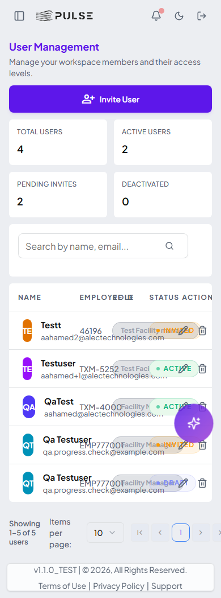

---

## BUG-002 — Permission Matrix overflows the viewport; role columns clipped, no scroll

- **Severity:** High
- **Page / URL:** Settings → Roles → Permission Matrix — `/settings/roles/permission-matrix`
- **Viewport:** Desktop (1440×900) + Mobile (390×844)

**Description.** The header states **"12 roles · 30 modules"**, but the matrix table is **~2225 px wide inside the 1440 px desktop viewport** (and ~2149 px on mobile). On desktop only ~7 role columns fit; the rightmost header is cut to **"SY…"** and columns such as *Organization Admin*, *System Integrator User*, *Viewer* and *Super Admin* sit beyond the visible area. There is **no visible horizontal scrollbar or scroll affordance**, so an admin cannot view or compare permissions for the hidden roles. This makes a core RBAC screen incomplete on a standard desktop width, and worse on mobile.

**Steps to reproduce.**
1. Sign in as Organization Admin.
2. Open **Settings → Roles → Permission Matrix** (`/settings/roles/permission-matrix`).
3. At 1440 px width, look at the role columns across the top.

**Expected.** All 12 role columns are reachable — either the table scrolls horizontally with a clear scrollbar/affordance, or columns condense to fit.

**Actual.** Only ~7 roles are visible; the last header ("SY…") is clipped at the viewport edge and the remaining roles cannot be viewed.

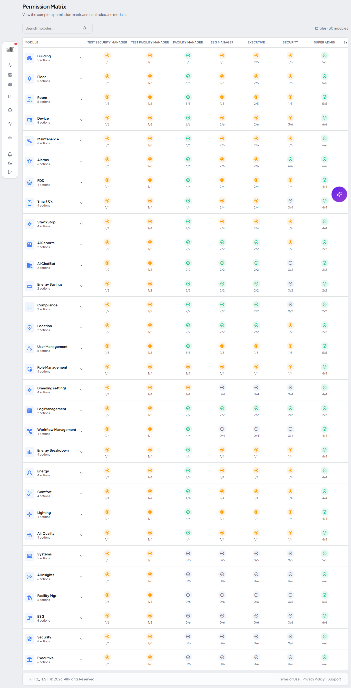

---

## BUG-003 — Greeting truncates the user's name to "Organi"

- **Severity:** Medium
- **Page / URL:** PULSE AI chat panel (appears globally; captured on Overview Map `/overview-map`)
- **Viewport:** Desktop + Mobile

**Description.** The PULSE AI chat panel greets the user with **"Good morning, Organi"** — the account name *"Organization Admin"* is cut off after 6 characters. The Portfolio Dashboard header renders the same user's name correctly in full ("Good morning, **Organization Admin**"), confirming the truncation is specific to the AI greeting component (likely a fixed character limit or a width clamp on the name).

**Steps to reproduce.**
1. Sign in as Organization Admin.
2. Open the PULSE AI chat panel (it appears on Overview Map and via the AI launcher).
3. Read the greeting line.
4. Compare with the Portfolio Dashboard greeting (`/`).

**Expected.** "Good morning, Organization Admin" (the full account name), matching the dashboard.

**Actual.** "Good morning, Organi" — the name is truncated.

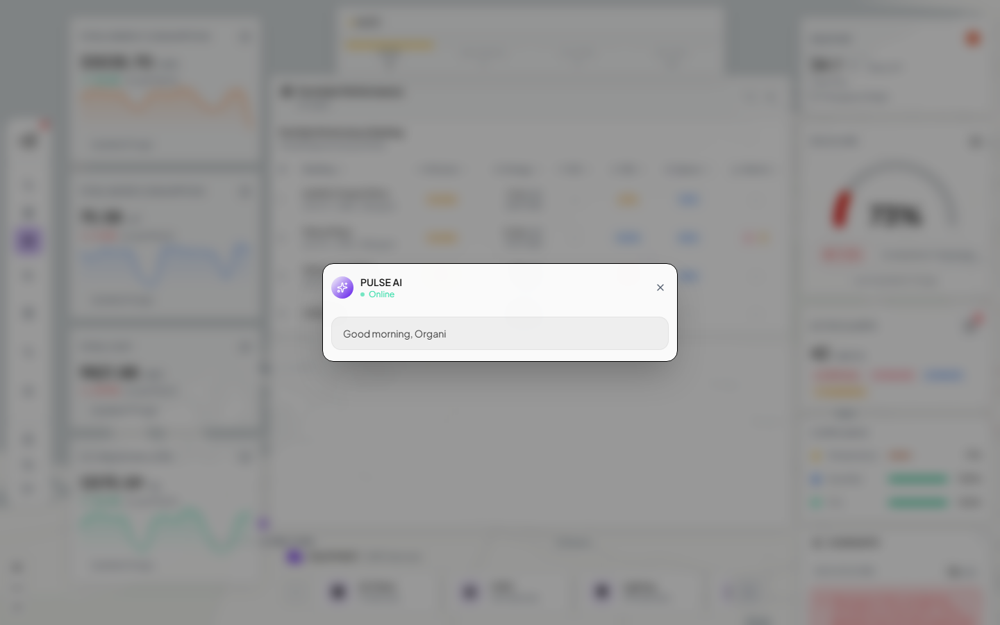

*Reference — dashboard renders the full name correctly:*

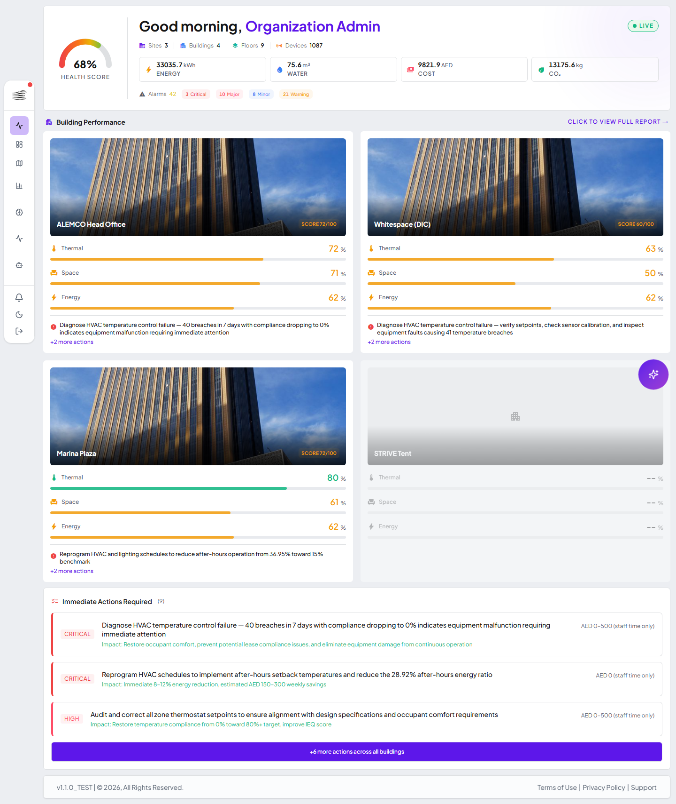

---

## BUG-004 — AI Reports: selector pills overlap and chapter tabs are clipped on mobile

- **Severity:** Medium
- **Page / URL:** AI Reports — `/reports`
- **Viewport:** Mobile (390×844)

**Description.** Two issues on the AI Reports header at mobile width:
1. The **Building / Floor selector pills overlap** — the audit measured an **86 % overlap** between the org/breadcrumb pills (`ALEC` ↔ `Building`, `ALEC DIC YARD` ↔ `Floor`) and a 38 % overlap with the building name, so the context selector is cramped and labels collide.
2. The **chapter tab strip is clipped** — tabs read "01 Briefing · 02 Action priority · 03 Thermal &…" with the third tab cut off and **no visible scroll affordance**, so chapters beyond the first two appear inaccessible.

**Steps to reproduce.**
1. Sign in as Organization Admin.
2. Open **AI Reports** (`/reports`) at mobile width (≈390 px).
3. Observe the building/floor selector row and the chapter tab strip near the top.

**Expected.** Selector pills wrap/space cleanly without overlapping, and the chapter tabs are fully reachable (horizontal scroll with affordance, or wrapping).

**Actual.** Selector pills overlap (86 %); the chapter tab strip clips the 3rd+ tabs with no scroll indicator.

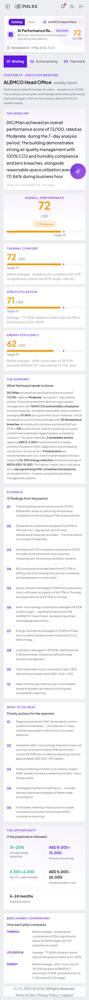

---

## BUG-005 — Overview Map auto-opens the AI chat modal over the map on load

- **Severity:** Medium
- **Page / URL:** Overview Map — `/overview-map`
- **Viewport:** Desktop (1440×900)

**Description.** Navigating to Overview Map auto-launches the **PULSE AI** chat modal, which renders centred with a **full-page dimming overlay**. The map and surrounding dashboard content are greyed out and blocked on first load, forcing the user to dismiss the modal before they can interact with the page they navigated to. (This same capture also surfaces BUG-003's truncated greeting.)

**Steps to reproduce.**
1. Sign in as Organization Admin.
2. Navigate to **Overview Map** (`/overview-map`).
3. Observe the page immediately after load.

**Expected.** The Overview Map loads ready to use; the AI assistant stays minimised/dismissed until the user opens it.

**Actual.** The AI chat modal auto-opens with a dimming overlay covering the map and content.


---

## BUG-006 — Asset Management map pin labels clip past the right viewport edge

- **Severity:** Low
- **Page / URL:** Asset Management — `/asset-management`
- **Viewport:** Desktop (1440×900)

**Description.** On the embedded map, site pin labels extend beyond the right edge of the viewport. The audit recorded the `.site-pin-label` "MARINA PLAZA" spanning to **x ≈ 1450 px** inside a 1440 px viewport, and the "MARINA PLA…" label is visibly cut off at the panel edge. The label should be clamped within the map container.

**Steps to reproduce.**
1. Sign in as Organization Admin.
2. Open **Asset Management** (`/asset-management`) at 1440 px.
3. Look at the map panel on the right; observe pin labels near the right edge (e.g. "MARINA PLAZA").

**Expected.** Pin labels stay within the map bounds (clamped or repositioned inward).

**Actual.** Labels overflow past the right edge and are clipped (e.g. "MARINA PLA…").

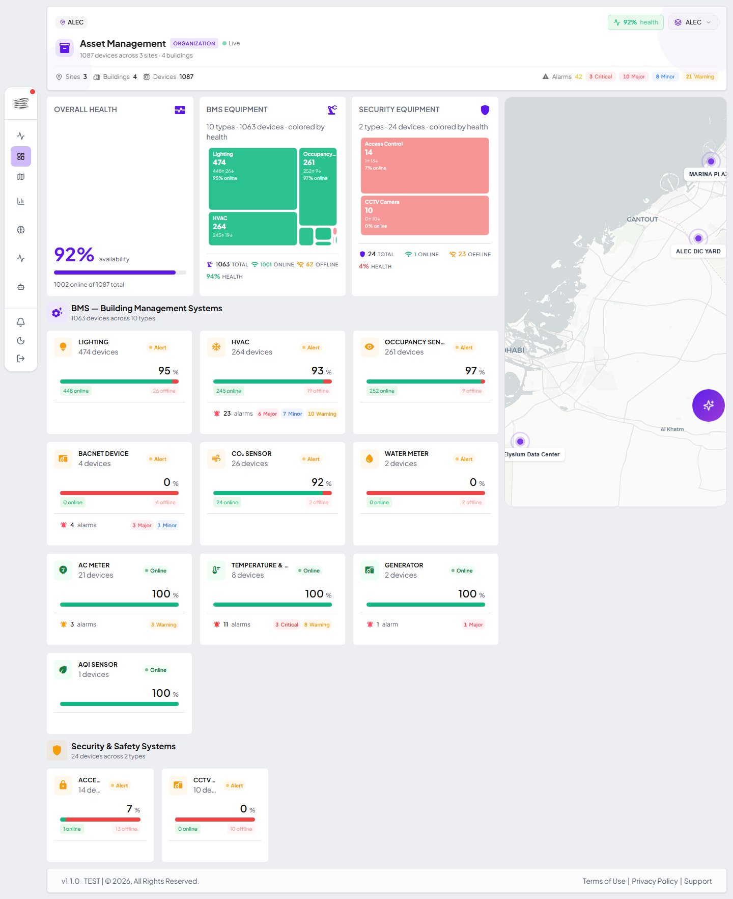

---

## BUG-007 — Multiple `<h1>` headings and duplicate `<main>` landmarks per page

- **Severity:** Low (accessibility / semantics)
- **Page / URL:** Global — every audited route
- **Viewport:** All

**Description.** The audit recorded **5 `<h1>` elements** on most pages (4 on a few) and **2 `<main>` landmarks** on every page. A page should have a single top-level `<h1>` and a single `<main>` landmark; the duplicates (largely from the always-mounted AI side panel — e.g. "PULSE AI Chatbot" / health-score panels — each contributing their own heading and main region) harm screen-reader navigation and document semantics/SEO.

**Steps to reproduce.**
1. Open any page (e.g. Portfolio Dashboard `/`).
2. Inspect the DOM, or run: `document.querySelectorAll('h1').length` and `document.querySelectorAll('main').length`.

**Expected.** Exactly one `<h1>` and one `<main>` per page.

**Actual.** 4–5 `<h1>` elements and 2 `<main>` elements per page.


---

## BUG-008 — Equipment card titles truncated with ellipsis on Asset Management

- **Severity:** Low
- **Page / URL:** Asset Management — `/asset-management`
- **Viewport:** Desktop (1440×900)

**Description.** Several equipment/category card titles are cut with an ellipsis even though there is room to wrap, e.g. **"ACCE…"** (Access Control), **"CCTV…"** (CCTV Camera), **"OCCUPANCY SEN…"** (Occupancy Sensor) and **"TEMPERATURE & …"**. The truncation hides the device type the card represents.

**Steps to reproduce.**
1. Sign in as Organization Admin.
2. Open **Asset Management** (`/asset-management`) at 1440 px.
3. Scan the BMS / Security equipment cards and the Security & Safety section.

**Expected.** Card titles display in full (wrap to a second line if needed).

**Actual.** Titles are truncated with "…", obscuring the device category.


---

## BUG-009 — Building card with no data shows blank image and "-- %" scores

- **Severity:** Low
- **Page / URL:** Portfolio Dashboard — `/`
- **Viewport:** Desktop (1440×900)

**Description.** In *Building Performance*, the **"STRIVE Tent"** card has no building image (grey placeholder with a generic icon) and renders **"-- %"** for Thermal, Space and Energy. While a no-data state may be valid, the presentation is inconsistent with the other cards (no styled empty-state, blank image) and reads as a broken/half-loaded card.

**Steps to reproduce.**
1. Sign in as Organization Admin.
2. Open the **Portfolio Dashboard** (`/`).
3. Scroll to *Building Performance* and look at the "STRIVE Tent" card.

**Expected.** A clearly-styled empty/"no data yet" state (or a fallback image) consistent with the other building cards.

**Actual.** Blank grey image and "-- %" metrics with no explanatory empty-state.


---

## BUG-010 — Role table is unreadable on mobile (columns overlap)

- **Severity:** High
- **Page / URL:** Settings → Roles — `/settings/roles`
- **Viewport:** Mobile (390×844)

**Description.** Same root cause as BUG-001, on the Role Management table. At 390 px the **headers merge** ("REMOTE LOGIN" + "LAST UPDATED" → `REMOTE LOGINLAST UPDATED…`), the role-name column is truncated ("Test…ager"), and the **STATUS pill, REMOTE-LOGIN value, date and delete icon overlap** in every row. The floating AI button also sits on top of row content. The table is unusable on mobile.

**Steps to reproduce.**
1. Sign in as Organization Admin.
2. Open **Settings → Roles** (`/settings/roles`).
3. Set the viewport to ~390 px (mobile).
4. Observe the roles table.

**Expected.** The table reflows to a stacked/card layout (or scrolls horizontally); all columns readable.

**Actual.** Headers merge; role name truncated; status/date/action cells overlap; the AI button overlaps rows.

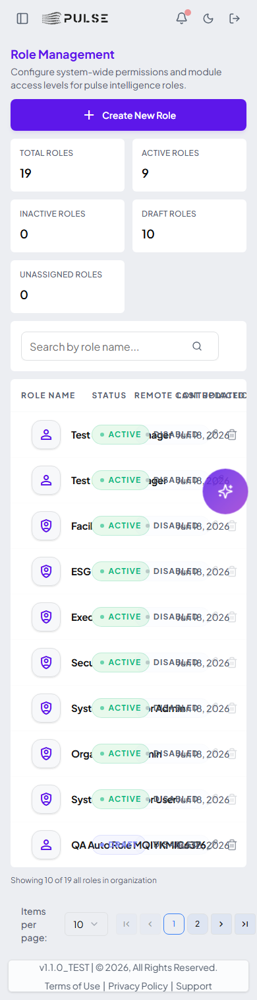

---

## BUG-011 — Status-filter segmented control overflows the viewport (Users & Roles, mobile)

- **Severity:** Medium
- **Page / URL:** Settings → Users `/settings/users` and Settings → Roles `/settings/roles`
- **Viewport:** Mobile (390×844)

**Description.** The status-filter segmented control ("All / Active / Inactive / Deactivated" on Users; "All / Active / Inactive / Unassigned" on Roles) is laid out at its desktop width and **extends to ~931 px (Users) / ~921 px (Roles)** inside a 390 px viewport. The later segments sit off-screen to the right with no scroll affordance, so users cannot reach all filter options on mobile. (This compounds the table-overlap defects BUG-001 / BUG-010 on the same screens.)

**Steps to reproduce.**
1. Sign in as Organization Admin.
2. Open **Settings → Users** (or **Roles**) at ~390 px.
3. Look at the status filter row above the table.

**Expected.** The filter control fits the viewport (wraps, condenses, or scrolls with an affordance).

**Actual.** The control overflows to ~920–931 px; later filter segments are off-screen and unreachable.


---

## BUG-012 — Overview Map device-legend chips spill past the right edge (desktop)

- **Severity:** Medium
- **Page / URL:** Overview Map — `/overview-map`
- **Viewport:** Desktop (1440×900)

**Description.** The horizontal device-type legend (glass-panel chips like "BACnet Device · 4 devices", "CO₂ Sensor · 26 devices") extends well **beyond the right edge of the 1440 px viewport** — the audit recorded chips at x ≈ 1595 px and ≈ 1785 px. The later chips are clipped and there is no visible scroll affordance to reach them, so part of the device legend is unreadable.

**Steps to reproduce.**
1. Sign in as Organization Admin.
2. Open **Overview Map** (`/overview-map`) at 1440 px.
3. Look at the device-type legend strip; note chips cut off at the right edge.

**Expected.** The legend fits within the viewport (wraps or scrolls with an affordance).

**Actual.** Legend chips spill past the right edge (to ~1785 px) and are clipped.


---

## BUG-013 — Energy Intelligence donut chart & labels overflow their container on mobile

- **Severity:** Medium
- **Page / URL:** Energy Intelligence — `/energy-savings`
- **Viewport:** Mobile (390×844)

**Description.** On mobile the "Opportunities" donut chart (fixed `200×200`) and its surrounding metric labels (e.g. "8–12 %", "5–10 %", "3–7 %") **overflow their card** — the audit recorded the donut spanning left ≈ −28 px and labels reaching ≈ 447 px inside a 390 px viewport. The fixed-size visual does not scale down for small screens. (This page is also *Integration Pending*; the overflow is a layout defect independent of the data state.)

**Steps to reproduce.**
1. Sign in as Organization Admin.
2. Open **Energy Intelligence** (`/energy-savings`) at ~390 px.
3. Observe the opportunities donut chart and the metric labels around it.

**Expected.** The chart and labels scale/reflow to fit the card on mobile.

**Actual.** The fixed-size donut and labels overflow the card bounds (left −28 px, labels to ~447 px).

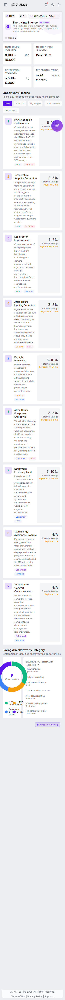

---

## BUG-014 — Operations preview tables overflow on mobile

- **Severity:** Low
- **Pages:** Work Orders `/maintenance`, Maintenance Calendar `/maintenance-calendar`, Fault Detection `/fdd`, Smart Commissioning `/smart-cx`
- **Viewport:** Mobile (390×844)

**Description.** The preview data tables on these operations modules are rendered at their full desktop column width on mobile and overflow well beyond 390 px (audit recorded table widths of ~656 px Work Orders, ~725 px Maintenance Calendar, ~760 px Fault Detection, ~623 px Smart Commissioning). Without a responsive reflow or scroll affordance, later columns (Status / Assigned / Due / Impact, etc.) are off-screen. These pages also carry the expected *Integration Pending* state, but the **table layout itself is not responsive** and should be fixed before/with integration.

**Steps to reproduce.**
1. Sign in as Organization Admin.
2. Open any of `/maintenance`, `/maintenance-calendar`, `/fdd`, `/smart-cx` at ~390 px.
3. Observe the data table; note columns extending past the right edge.

**Expected.** Tables reflow to a mobile layout or scroll horizontally with an affordance.

**Actual.** Tables render at desktop width (~620–760 px) and overflow the mobile viewport.

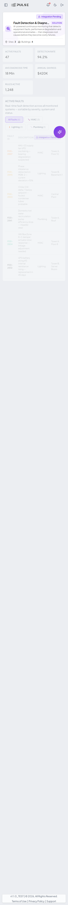

---

# Part C — Live exploratory session (Playwright MCP, authenticated)

**Method.** A live, browser-driven exploratory pass was performed as **Organization Admin** at desktop width (1440×900) using Playwright MCP — logging in and walking **every** route in sequence while capturing screenshots, DOM diagnostics, **console errors** and **network responses** on each page. This pass targets *behavioural / data / integration* defects that the static visual audit (Part B) does not catch. Evidence screenshots are stored in [qa-live/](../../qa-live/) and embedded beneath each finding.

> These are **new** findings, separate from BUG-001…014. Network/console evidence was captured directly from the running app (`test.be.alt-pulse.com` BFF, `pulse.alec.ae` ThingsBoard, `api.openweathermap.org`).

## C.1 New defect summary

| ID | Severity | Area | Defect |
|----|----------|------|--------|
| BUG-015 | High | AI Chat ↔ Dashboard | AI Chat reports a **different Portfolio Health Score (82.5 %)** than the Dashboard (**68 %**) — same metric, conflicting values |
| BUG-016 | Medium | Overview Map → Weather | Weather fails to load — OpenWeatherMap `onecall` returns **401 Unauthorized** (API key invalid/expired); key is also **exposed in the client request URL** |
| BUG-017 | Medium | AI Chat | Raw ThingsBoard **asset UUID leaks into the chat UI** (`4efade60-1cb8-11f1-9a9a-bd8122029431`) |
| BUG-018 | Low | Chat backend (global) | `POST /api/chat/combine` returns **404 on every page** (background call; chat still works via other endpoints) |
| BUG-019 | Low | Settings → Roles | Role-name **capitalisation inconsistency** ("Test Facility manager" — lowercase *m*) |
| BUG-020 | **High** | RBAC / Security | **Broken access control** — a non-admin (Facility Manager) reaches admin pages (`/settings/users`, `/settings/roles`, `/settings/roles/permission-matrix`) via **direct URL**; route guards missing |
| BUG-021 | **High** | RBAC / Data scope | **Dashboard KPIs leak full-org data** to a site-scoped user — Devices = **1087** (full org) vs **552** correctly scoped in Asset Management; Water / Cost / CO₂ also show full-org totals |
| BUG-022 | Low | Chat backend (new users) | `GET /api/chat/history` returns **404** for a freshly created user (returned 200 for the Org Admin) |
| BUG-023 | **High** | Portfolio map → Room select | A **fixed bottom panel (`z-[101] pointer-events-auto`) intercepts pointer events**, so real clicks on room cards / their right-arrow icon in the lower region don't register — the room is **unselectable by click** |
| BUG-024 | **High** | Portfolio map → Room details | The room-details ("ROOM ANALYTICS") **X / close button does not close the panel** — clicking it has no effect (broken close handler) |
| BUG-025 | Low | Global UI consistency | **Inconsistent hover affordance** — Building Performance cards highlight the corner arrow in **purple** on hover (`hover:bg-purple`), but other cards (e.g. Floor cards) use a **grey** circle (`bg-surface-container-highest`) with no purple hover |
| BUG-026 | Medium | Portfolio map → AI chat launcher | **Duplicate / mis-rendered AI chat launcher** on `/overview-map` — the n8n "PULSE AI Chatbot" widget toggle collapses to **0×0** while a separate app "Talk to My Building" sparkles launcher renders; during the widget's load the two overlap (two purple circles). Other dashboards render a single working launcher |
| BUG-027 | Medium | Portfolio map → Room device cards | **Inconsistent / dead affordances on ROOM ANALYTICS device cards** — the **HVAC** card shows a purple arrow but has `border-0`/no `hover:border` and `cursor:auto` (no hover border, not clickable); the **Lighting** and **Sensors** cards highlight a purple border on hover and look clickable (`cursor-pointer`, `hover:border-purple`) but **clicking does nothing** (dead handler) |
| BUG-028 | **High** | Performance — ALEC org page | Navigating to the **ALEC organization page** (`/home/legacy/`) from a detail page takes **~15–19 s to render content** (measured 18.6 s then 15.2 s) — the URL switches in ~0.5 s but a skeleton shows for 15–19 s. Document loads in 185 ms, so the delay is **client-side org-aggregation fetch/render**, far over a reasonable < 5 s |
| BUG-029 | Low | Building detail → Alarm Details popup | **Header misalignment** — the floor card's "N active alarms" opens an **Alarm Details** popup whose header **"N ALARMS" badge overlaps the X close button by ~8 px** and is **~9–11 px vertically off-centre** from the title and X (badge's `ml-auto` collides with the absolutely-positioned close) |
| BUG-030 | **Critical** | Auth — session / token refresh | **Unexpected logout on page refresh.** `POST /api/user/refresh` returns **`500 {"error":"Organization is not defined"}` every time** (6/6) even with a **valid, unexpired refresh token**. Once the short-lived access token lapses, the next refresh/navigation triggers this broken endpoint; the client then **wipes all tokens and redirects to `/login`**. Surfaces as "logged out after 4–5 refreshes" because the access token stays valid for a while before the failing refresh path is hit |
| BUG-031 | Medium | Overview Map — zoom controls | **Map zoom +/− (and compass) buttons do nothing.** The MapLibre control cluster sits at the **bottom-left at `z-index: 2`**, but the **EQUIPMENT legend bar** (`fixed bottom-0 left-0 right-[calc(320px+0.5rem)] z-[101] pointer-events-auto`, rect `0,652 → 1208×118`) **covers the entire bottom-left strip** where the buttons live. `elementFromPoint` on all three buttons returns the equipment bar, so **real clicks hit the equipment/device chips (which highlight) instead of zooming** — a programmatic click confirms the buttons themselves zoom fine. Same overlay-interception class as BUG-023 |
| BUG-032 | Medium | Home dashboard — Building Performance cards | **Hover expansion destabilises the whole row.** Hovering a Building Performance card reveals a details panel via `grid-rows-[0fr] → group-hover:grid-rows-[1fr]` (500 ms), growing the card **470 → 699 px**. Because the four cards share an `items-stretch` row, hovering **one** card stretches **all four** (measured: 0 hovered → all `470`; any 1 hovered → all `699`), and everything below shifts **~229 px**. Sweeping the cursor across the row fires overlapping 500 ms expand/collapse animations — the cards visibly **fluctuate/jitter** |
| BUG-033 | Medium | Asset Management — Fire Alarm category | **Phantom device count.** The **Fire Alarm** card (Security & Safety) shows **"1 device · 100% · 1 online"**, but opening it shows **"0 devices in ALEC · No devices found."** The backend device-type registry (`/api/device/types`) contains **no Fire Alarm type and no Fire Alarm device** — it is a front-end taxonomy entry with a phantom count. It is **intermittent**: when absent, Security = `2 types·24 devices` and totals reconcile (`1063+24=1087`); when the phantom appears, Security = `3 types·25 devices` yet the org total stays `1087` (would be 1088) — internally inconsistent |
| BUG-034 | Low | Alarm Details → Additional Information JSON | **Copy button does nothing.** In the Alarm Details popup, expanding *Additional Information* shows the alarm JSON with a **copy icon** (`lucide-copy`). Clicking it **does not copy** — instrumented live: the button is the topmost element (no overlay), has **no `onClick` handler**, and neither a real nor a programmatic click fires `navigator.clipboard.writeText` / `write` / `document.execCommand('copy')`; the clipboard (seeded with a sentinel) is **unchanged**. Only manual mouse-select + Ctrl+C (native copy) works |
| BUG-035 | Medium | Notifications panel — header clipped at 100% zoom | **Notification panel header hidden at 100% zoom.** Opening the Notifications panel renders a **Radix Popover** positioned `fixed; transform: translate(0,-35px)` with **834 px content height not clamped to the viewport**. On a 100%-zoom viewport (770 px tall) the panel top lands at **−75 px**, so the `sticky` header ("Notification (3129)" + **Mark all as read**) sits at **y −74…−21 — entirely above the viewport** and is unreachable. At 75% zoom (taller CSS viewport) the top stays on-screen and the full header shows |
| BUG-036 | Low | Global — font brightness/colour consistency (light + dark) | **Inconsistent text brightness.** **Building cards** use **hard-coded** `text-white` (title) and `text-white/60` (subtitle — **60% opacity white**), which **don't adapt to theme** and render the subtitle visibly **dimmer** than other cards; over lighter photo areas the white title also has low/variable contrast (no dark scrim). Other cards use **theme tokens** (`text-foreground`, `text-secondary`) that adapt per mode. App-wide, body text mixes several brightness tokens (pure black `lab(2.75)`, near-black `lab(7.78)`, slate `rgb(30,41,59)`, secondary `rgb(86,97,112)`, muted `lab(48.5)`). The dimmer `text-white/60` building subtitle persists in **dark mode** too |
| BUG-037 | Medium | Overview Map — Portfolio Performance panel | **No way to re-open after closing.** The Portfolio Performance panel has a **Close (X)** button that removes it, but there is **no control anywhere to bring it back** — a DOM-wide search for any button/link mentioning portfolio/performance/ranking/show/open returns **nothing**. The closed state is **not persisted** (no storage key), so the **only** way to restore it is a **full page reload**. Confirmed live: after Close, `Portfolio Performance` count = 0 and no re-open affordance exists |
| BUG-038 | Medium | Overview Map — Performance panel (drilled-down) | **Close (X) dead once drilled in.** The X closes the panel **only at the top level** (Portfolio Performance). After drilling into a site/building/floor (→ **Floor / Room Performance**, as in the maximized view), the **Close (X) is a complete no-op** — confirmed live: 2 consecutive real clicks leave the panel present, same title/breadcrumb, no navigation — in **both maximized and restored** states. **Exit Fullscreen / maximize works** in all states. Only after using the back (chevron) to return to the top level does **X close** again |
| BUG-039 | **High** | Asset Management — hard refresh ignores scope | **Hard refresh shows out-of-scope buildings.** A normal refresh shows the org-scoped **4 buildings / 1087 devices**; a **hard refresh** (cache-bypass cold start) shows **~15 buildings / 1115 devices** — including buildings the scope hides (Camp-12/Kitchen, Site Office Block A–G, ICAD Warehouse, Tent-5, DIC/Main…). Confirmed via backend: `/api/hierarchy/tree/scoped` and `assets?type=Building` return **16** buildings; the narrowing to 4 is **client-side** from `pulse-resourceScope`. On a cold start the list renders **before** the scope filter hydrates, so the full set shows (and counts mismatch) |
| BUG-040 | Medium | Active Alarms → Alarm Details — acknowledge state | **Acknowledge button persists after acknowledging + flickers on close.** After acknowledging in the Alarm Details popup the **Acknowledge button stays visible/enabled** (should be hidden once acknowledged). Confirmed live: `POST /api/alarm/{id}/ack` → **200** (success), then a repeat ack → **400** (already acknowledged) — proving the button shouldn't still be there. On **closing via X**, the footer flickers: measured the button set go from `Clear` only → `Acknowledge + Clear` **while the dialog fades out** (wrap opacity 0) — the Acknowledge button reappears during the close animation |
| BUG-041 | Low | HVAC device live view — airflow diagram | **Ambient card overlaps the SUPPLY header.** On the HVAC device "Live" airflow diagram (ROOM → COOLING COIL → FAN → SUPPLY), the floating **Ambient / Target** summary card (SVG `<g>`) is positioned top-right so its background `rect` **overlaps the "SUPPLY" column label by ~54 × 11 px** and paints **on top of** it. Reproduced on a *different* device than reported (FREE HOD vs Z5-Work Shop 1) — a **shared component** layout collision present on every HVAC device |
| BUG-042 | Low | PULSE AI Chatbot — scroll containment | **Scrolling the chat scrolls the page (scroll chaining).** The chat message container `.chat-body` is scrollable (scrollHeight 13571 vs clientHeight 459) but uses the default **`overscroll-behavior: auto`** — captured natively before any change — so when the chat is at a scroll boundary (it opens pinned to the bottom) the wheel **chains to the document** and the **page** scrolls instead of staying put. Page is independently scrollable (486 px). Fix: `overscroll-behavior: contain` on `.chat-body` |

**Part C totals:** 1 Critical · 7 High · 11 Medium · 9 Low = **28 new defects.**

---

## BUG-015 — AI Chat reports a different Portfolio Health Score than the Dashboard

- **Severity:** High
- **Page / URL:** PULSE AI Chat (`/ai-chat`) vs Portfolio Dashboard (`/`)
- **Viewport:** Desktop (1440×900)

**Description.** Asked *"What is my portfolio health score?"*, the PULSE AI assistant answers coherently but reports **"Overall Health Score: 82.5 %"** for the ALEC organization. The **Portfolio Dashboard hero** for the same organization, same session, shows **68 % HEALTH SCORE**. The AI's 82.5 % figure also appears in the AI side-panel rendered on other pages (e.g. the Create-Role screen heading "ALEC Organization — Current Health Score… Overall Health Score: 82.5 %"). Two different "Overall Health Score" numbers for the same org in the same session is a **data-trust defect** — a user cannot tell which figure is authoritative.

**Steps to reproduce.**
1. Sign in as Organization Admin.
2. On the Portfolio Dashboard (`/`), note the hero **HEALTH SCORE** value (**68 %**).
3. Open **AI Chat** (`/ai-chat`) and send: *"What is my portfolio health score?"*
4. Read the assistant's reported **Overall Health Score** (**82.5 %**).

**Expected.** The AI assistant and the Dashboard report the **same** Portfolio/Organization health score (or clearly label them as distinct metrics with distinct names).

**Actual.** AI Chat = **82.5 %**; Dashboard = **68 %** — same label, conflicting values.

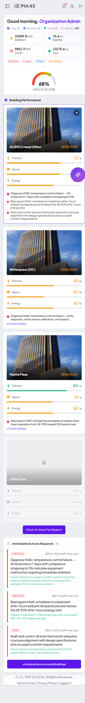

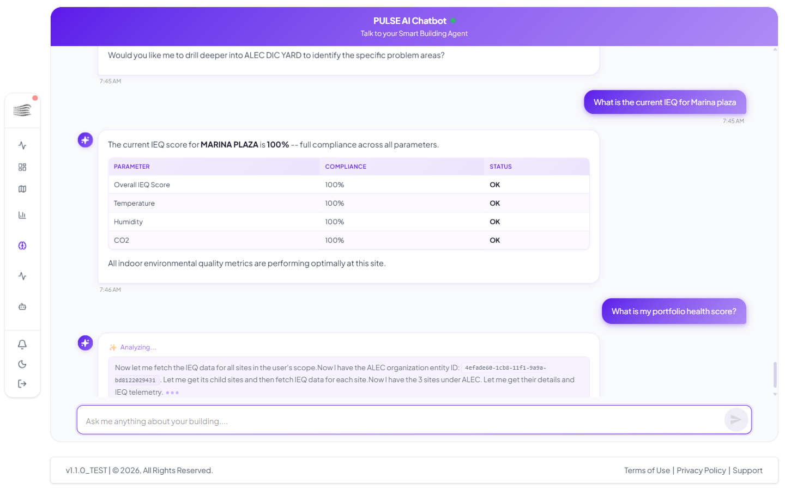

---

## BUG-016 — Overview Map weather fails to load (OpenWeatherMap 401; key exposed in URL)

- **Severity:** Medium
- **Page / URL:** Overview Map — `/overview-map`
- **Viewport:** Desktop (1440×900)

**Description.** On the Overview Map, the per-site weather lookups to OpenWeatherMap fail with **HTTP 401 Unauthorized**, so weather data does not render for the portfolio sites. Two failing calls were captured live (one per site with coordinates):

```
GET https://api.openweathermap.org/data/3.0/onecall?lat=25.0754…&lon=55.1398…&…&appid=523ac3ec0964ada8928d237dc3f18014  → 401 Unauthorized
GET https://api.openweathermap.org/data/3.0/onecall?lat=24.6809…&lon=54.8920…&…&appid=523ac3ec0964ada8928d237dc3f18014  → 401 Unauthorized
```

A 401 indicates the **API key is invalid, expired, or not subscribed to the One Call 3.0 endpoint**. Secondary security note: the **API key is embedded in the client-side request URL** (`appid=523ac3ec…`), so it is visible to anyone inspecting network traffic — the weather call should ideally be proxied through the backend.

**Steps to reproduce.**
1. Sign in as Organization Admin.
2. Open **Overview Map** (`/overview-map`).
3. Open the browser DevTools → Console / Network.
4. Observe the OpenWeatherMap `onecall` requests returning **401**.

**Expected.** Weather data loads for each site (200 OK); the API key is not exposed client-side.

**Actual.** `onecall` returns **401 Unauthorized** (×2); no weather data renders; the key is visible in the request URL.

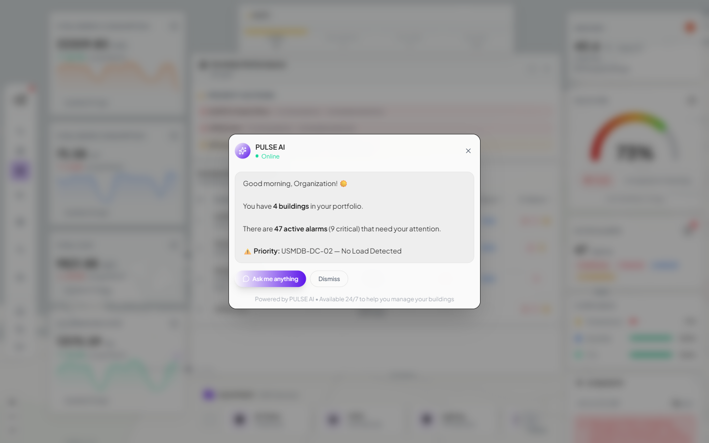

---

## BUG-017 — Raw ThingsBoard asset UUID leaks into the AI Chat UI

- **Severity:** Medium
- **Page / URL:** PULSE AI Chat — `/ai-chat`
- **Viewport:** Desktop (1440×900)

**Description.** During the AI Chat conversation, a **raw internal asset identifier** is surfaced in the user-facing text: `4efade60-1cb8-11f1-9a9a-bd8122029431`. This is the **ThingsBoard ASSET UUID** for the organization (the same id used in the telemetry API calls, e.g. `…/plugins/telemetry/ASSET/4efade60-1cb8-11f1-9a9a-bd8122029431/values/timeseries…`). Internal identifiers should never be shown to end users — they are meaningless to the user and leak backend implementation details.

**Steps to reproduce.**
1. Sign in as Organization Admin.
2. Open **AI Chat** (`/ai-chat`) and interact with the assistant.
3. Inspect the rendered response text for the raw UUID `4efade60-…`.

**Expected.** The chat shows human-readable entity names (e.g. "ALEC Organization"), never raw UUIDs.

**Actual.** The raw asset UUID `4efade60-1cb8-11f1-9a9a-bd8122029431` appears in the chat UI.

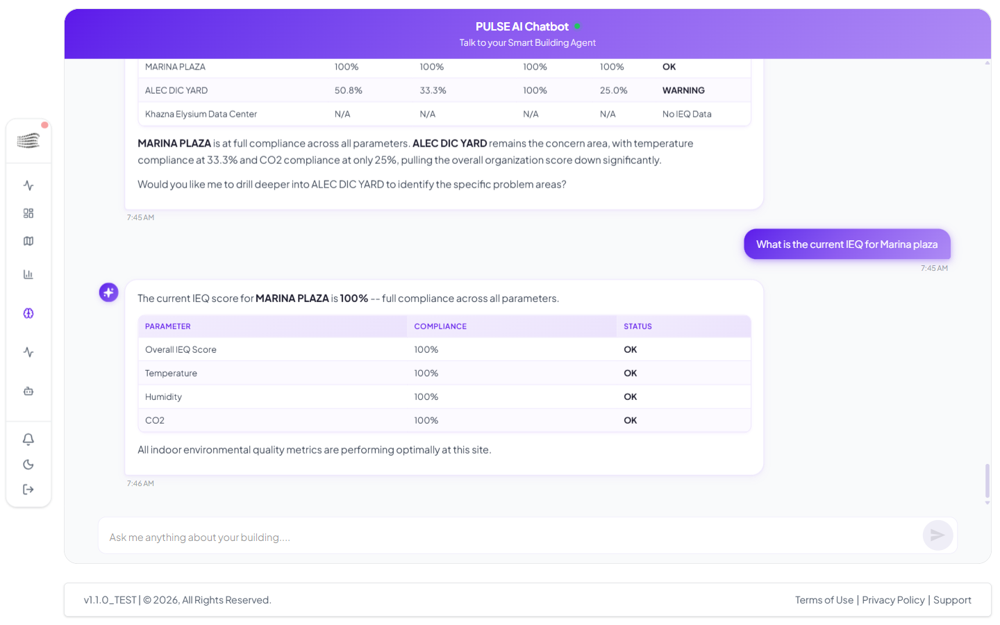

---

## BUG-018 — `POST /api/chat/combine` returns 404 on every page

- **Severity:** Low
- **Page / URL:** Global (BFF `test.be.alt-pulse.com`)
- **Viewport:** Desktop (1440×900)

**Description.** On **every** authenticated page, a background request `POST https://test.be.alt-pulse.com/api/chat/combine` returns **404 Not Found** — it is the single console error present site-wide. The AI Chat feature itself still works because the conversation is served by other endpoints that return 200 (`/api/chat/history`, `/api/chat/welcome-card`). So this is **not** a user-blocking break, but a **dead/renamed endpoint** that pollutes the console on every navigation and should be removed or fixed.

**Steps to reproduce.**
1. Sign in as Organization Admin.
2. Open any page and watch the Network/Console.
3. Observe `POST /api/chat/combine → 404` firing on each page load.

**Expected.** No 404s on routine page loads; obsolete endpoints removed.

**Actual.** `POST /api/chat/combine` → **404 Not Found** on every page.

> Evidence: captured live in the network log — `71. [POST] https://test.be.alt-pulse.com/api/chat/combine => [404] Not Found` while `/api/chat/history` and `/api/chat/welcome-card` return 200.

---

## BUG-019 — Role-name capitalisation is inconsistent in the Roles list

- **Severity:** Low
- **Page / URL:** Settings → Roles — `/settings/roles`
- **Viewport:** Desktop (1440×900)

**Description.** In the Roles list, role names are not consistently title-cased. **"Test Facility manager"** renders with a lowercase **m** on "manager", whereas peer roles use title case (e.g. *"Test Security Manager"*, *"Facility Manager"*). This is a cosmetic consistency defect on a settings screen.

**Steps to reproduce.**
1. Sign in as Organization Admin.
2. Open **Settings → Roles** (`/settings/roles`).
3. Compare the casing of "Test Facility manager" against the other role names.

**Expected.** Consistent title-casing for role names ("Test Facility Manager").

**Actual.** "Test Facility manager" uses a lowercase *m*.

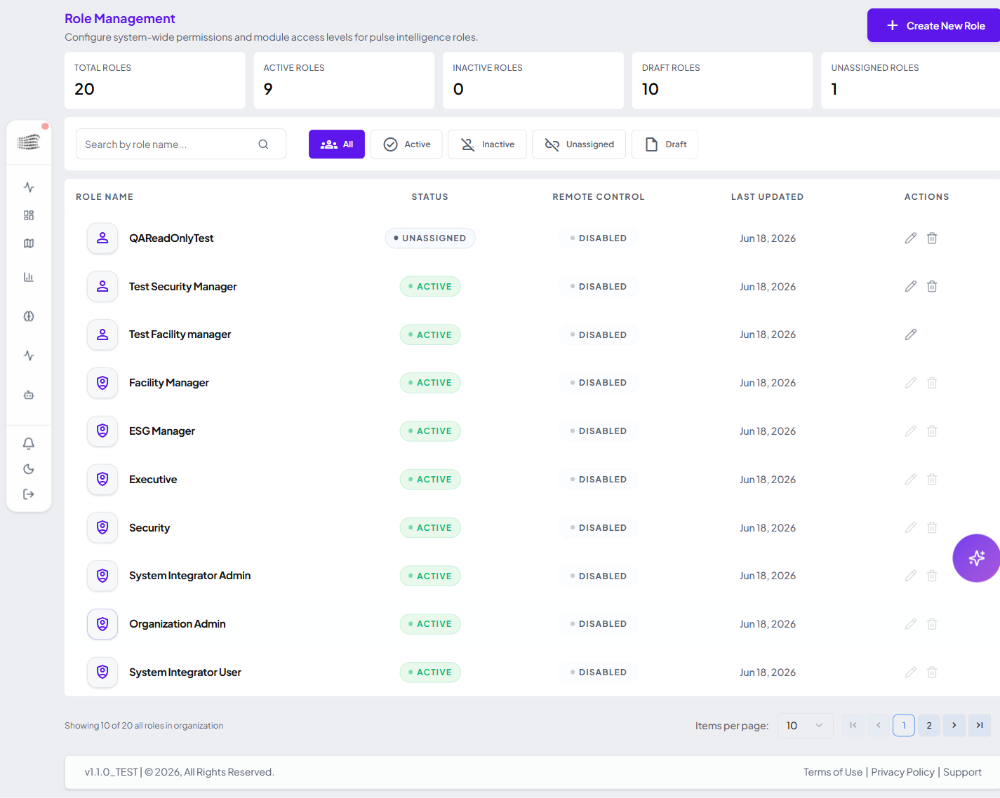

---

## C.2 RBAC verification (positive results — no defect)

A live RBAC exercise was run end-to-end (authorised QA test data, `QA`-prefixed). These passed and are recorded as **positive** evidence, not defects:

| Check | Result | Evidence |
|-------|--------|----------|
| Create Role wizard (3 steps: Role Name → Permissions → Review) | ✅ Role **QAReadOnlyTest** created successfully | 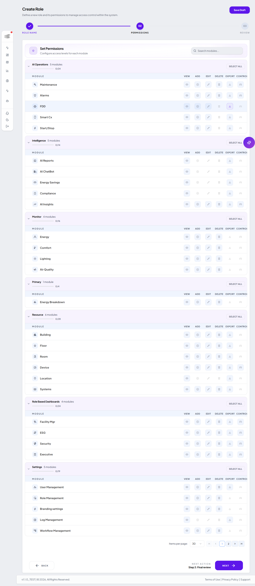 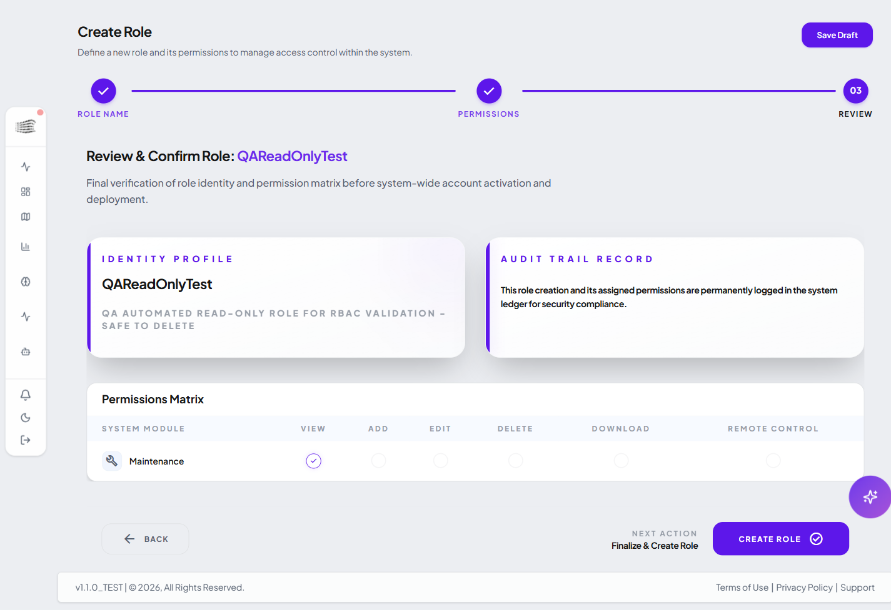 |
| Role-name input validation | ✅ Rejects special characters incl. underscore ("alphanumeric without special characters") | — |
| New role lifecycle | ✅ New role lands **UNASSIGNED** and must be placed in a **Workflow** before it can be assigned | 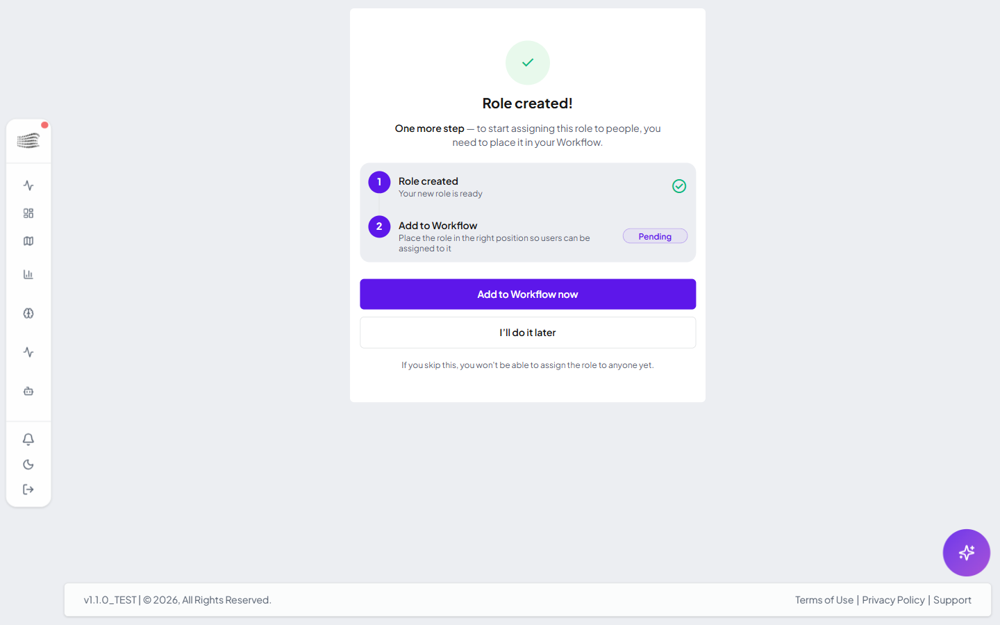 |
| Workflow gating of role assignment | ✅ The unassigned `QAReadOnlyTest` is **not selectable** in the user **Assign Role** dropdown until added to a Workflow | 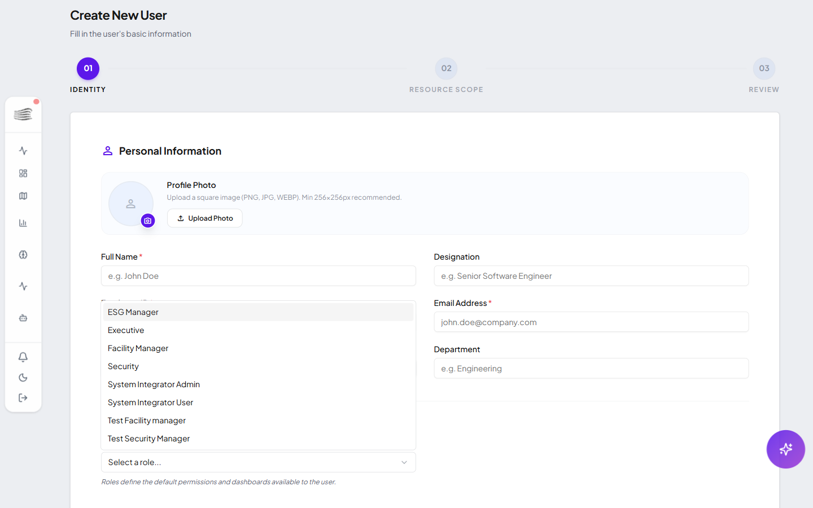 |
| Permission matrix granularity | ✅ Per-module **view / create / edit / delete / download / control** toggles present across all modules | (see permissions step above) |

## C.2a Sub-user RBAC live validation (Facility Manager, scoped to MARINA PLAZA)

A restricted user was created live and the session was driven **as that user** to validate enforcement. **User:** `aahamed+2@alectechnologies.com` ("QA Test User") · **Role:** Facility Manager · **Resource scope:** **MARINA PLAZA only** (ALEC DIC YARD and Khazna Elysium Data Center deliberately excluded). Provisioning is invite-only; the user set their own password via the emailed link, then the QA login was performed in the live browser.

**What enforced correctly (positive):**

| Check | Expected | Result | Evidence |
|-------|----------|--------|----------|
| Login as invited user | Lands on dashboard as "QA Test User" | ✅ "Good afternoon, QA Test User" | 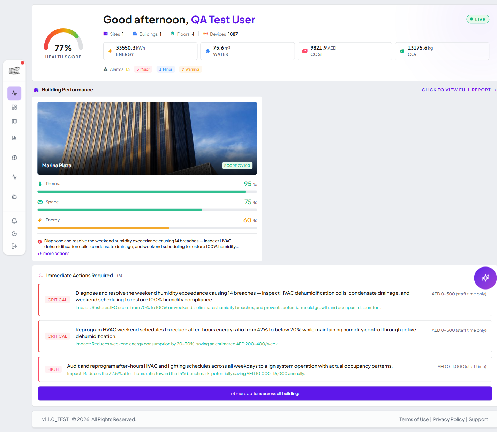 |
| Navigation surface | Only the role's allowed sections | ✅ Sidebar limited to Dashboard, Asset Management, Overview Map, Reports (no Settings/Users/Roles) |  |
| Overview Map scope | Only Marina Plaza | ✅ Only MARINA PLAZA shown; other sites absent | 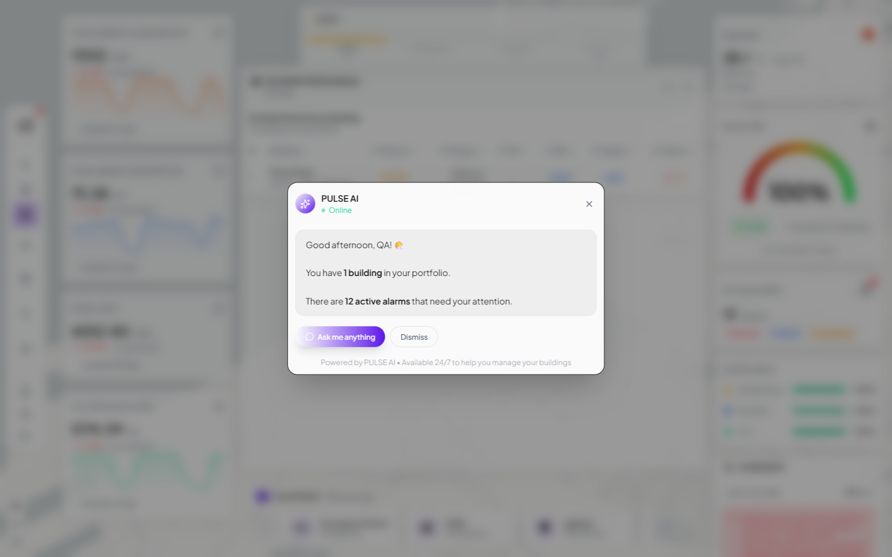 |
| Asset Management scope | Only Marina Plaza inventory | ✅ "552 devices across **1 site · 1 building**" | 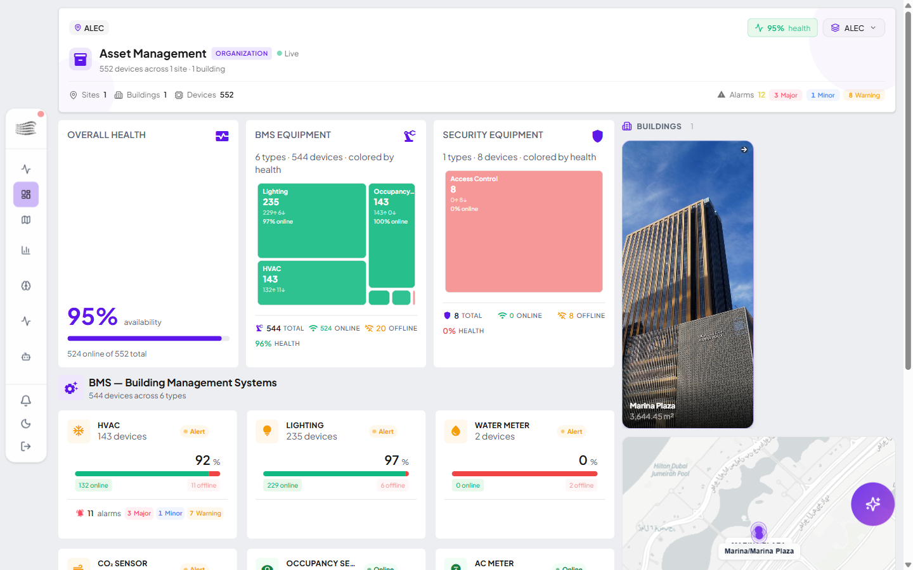 |
| Reports scope | Only Marina Plaza | ✅ "Marina Plaza · AI Performance Report" | 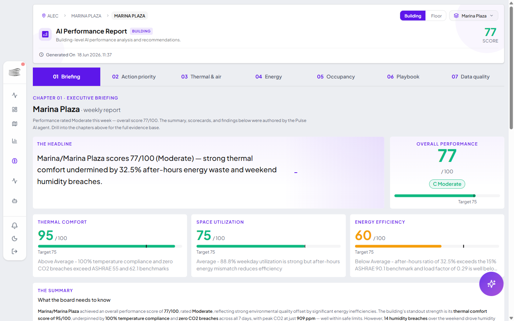 |
| Dashboard hierarchy counters | Scoped counts | ✅ Sites **1**, Buildings **1**, Floors **4** |  |

**What failed enforcement — see BUG-020, BUG-021, BUG-022 below.**

---

## BUG-020 — Broken access control: non-admin reaches admin pages via direct URL

- **Severity:** High (Security — OWASP A01: Broken Access Control)
- **Role under test:** Facility Manager (`aahamed+2@…`), scoped to Marina Plaza
- **Viewport:** Desktop (1440×900)

**Description.** The Facility Manager's navigation correctly **hides** the admin Settings sections, but those pages are **not protected** — typing the URL directly loads the **full admin UI with live data**:

| Direct URL | Result | What rendered |
|-----------|--------|----------------|
| `/settings/users` | ❌ Reachable | "User Management" with the **Invite User** control |
| `/settings/roles` | ❌ Reachable | "Role Management" — **TOTAL ROLES 10**, **Create New Role** action, full role list |
| `/settings/roles/permission-matrix` | ❌ Reachable | Full permission matrix — **13 roles × 30 modules** (incl. internal `QAREADONLYTEST`) |

This is a classic **missing authorization check** on protected routes: hiding a link in the menu is not access control. A non-admin can view (and the UI exposes the controls to modify) organization-wide users, roles and the permission matrix. **Server-side authorization** must reject these routes for roles without the corresponding permission, and the client route guard should redirect.

**Steps to reproduce.**
1. Log in as the Facility Manager user (`aahamed+2@…`).
2. Note the sidebar has no Settings/Users/Roles entries.
3. In the address bar, navigate directly to `/settings/users`, then `/settings/roles`, then `/settings/roles/permission-matrix`.
4. Observe each admin page renders fully with live data and action controls.

**Expected.** Each admin route returns an authorization error / redirect to an allowed page (or a 403) for a role without admin permission.

**Actual.** All three admin pages load fully for the Facility Manager.

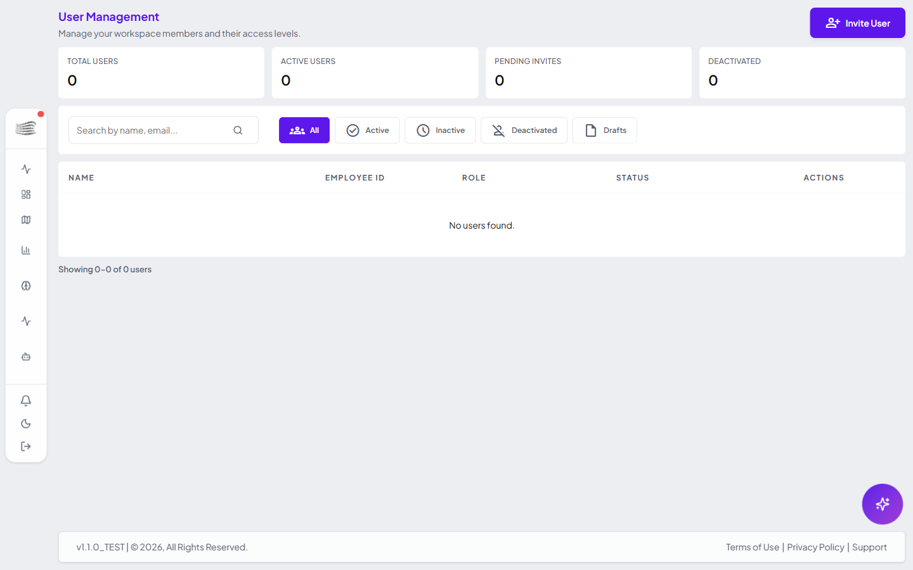

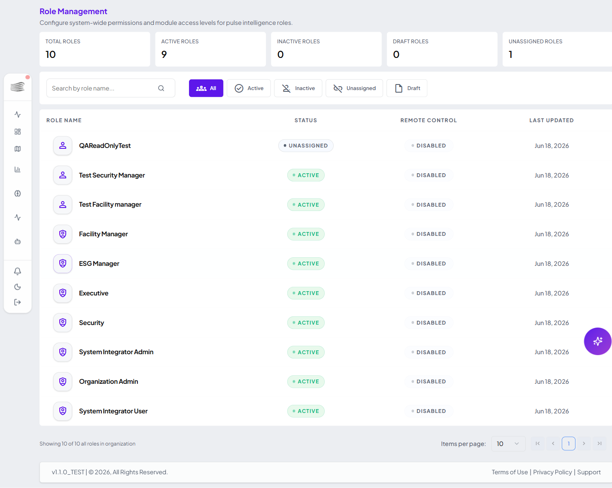

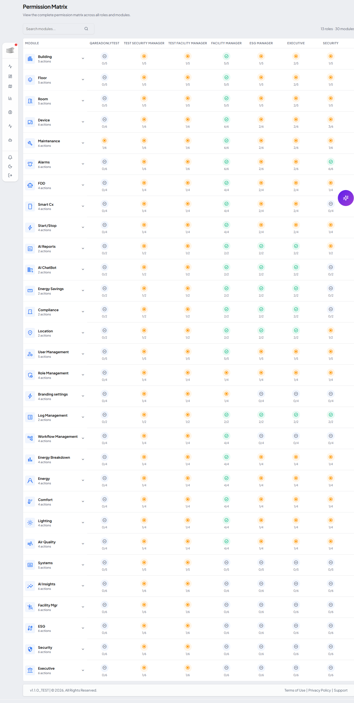

---

## BUG-021 — Portfolio Dashboard KPIs leak full-organization data to a site-scoped user

- **Severity:** High (Data scope / confidentiality)
- **Role under test:** Facility Manager scoped to **MARINA PLAZA only**
- **Viewport:** Desktop (1440×900)

**Description.** While the Dashboard correctly scopes the **hierarchy counters** (Sites 1, Buildings 1, Floors 4) and the **Asset Management** page correctly reports **552 devices** for the same scope, the **Portfolio Dashboard KPI tiles show full-organization totals**:

| Metric | Scoped user sees (Dashboard) | Correct scoped value | Full-org value (Org Admin) |
|--------|------------------------------|----------------------|----------------------------|
| Devices | **1087** ❌ | 552 (per Asset Management) | 1087 |
| Water | **75.6 m³** ❌ | (site subset) | 75.6 m³ |
| Cost | **9821.9 AED** ❌ | (site subset) | 9821.9 AED |
| CO₂ | **13175.6 kg** ❌ | (site subset) | 13175.6 kg |
| Sites / Buildings / Floors | 1 / 1 / 4 ✅ | 1 / 1 / 4 | 3 / 4 / 9 |

The **Devices** count and the **Water / Cost / CO₂** KPIs match the **full-organization** figures seen by the Org Admin, i.e. the Dashboard is aggregating across **all** sites for a user who should only see Marina Plaza. This leaks aggregate data outside the user's resource scope and is internally inconsistent with the correctly-scoped Asset Management view.

**Steps to reproduce.**
1. Log in as the Facility Manager user scoped to Marina Plaza.
2. On the Portfolio Dashboard note **Devices = 1087** and the Water/Cost/CO₂ KPI values.
3. Open **Asset Management** — note **552 devices · 1 site · 1 building**.
4. Compare: the Dashboard device count (and the resource KPIs) reflect the whole org, not the scoped site.

**Expected.** All Dashboard KPIs reflect only the user's resource scope (Marina Plaza), consistent with Asset Management.

**Actual.** Dashboard Devices = 1087 (full org) and Water/Cost/CO₂ equal the full-org totals, while Asset Management correctly shows 552.


---

## BUG-022 — `GET /api/chat/history` returns 404 for a newly created user

- **Severity:** Low
- **Role under test:** Facility Manager (`aahamed+2@…`)
- **Viewport:** Desktop (1440×900)

**Description.** For the freshly created user, the AI chat history endpoint fails with **404 Not Found** on every page (it returned **200** for the established Org Admin account):

```
GET https://test.be.alt-pulse.com/api/chat/history?userId=6a339f5ae8dd11e11137dc8e&page=1&limit=1  → 404 Not Found
GET https://test.be.alt-pulse.com/api/chat/history?userId=6a339f5ae8dd11e11137dc8e&page=1&limit=20 → 404 Not Found
```

This suggests chat history is not initialised for new users, producing console errors on every page for them. Low severity (no hard block observed) but should be handled (return an empty history `200`, or lazily create the record).

**Steps to reproduce.**
1. Create a new user and log in as them.
2. Open any page with DevTools → Network/Console.
3. Observe `GET /api/chat/history` returning 404.

**Expected.** New users get an empty chat history (`200` with empty list), no console errors.

**Actual.** `GET /api/chat/history` → 404 for the new user.

---

## BUG-023 — Portfolio drill-down: rooms are not selectable by click (fixed overlay intercepts pointer events)

- **Severity:** High (blocks the room drill-down via mouse)
- **Page / URL:** Portfolio / Overview Map — `/overview-map` → building → floor → room dashboard
- **Viewport:** Desktop (1440×900)

**Description.** In the Portfolio drill-down, after selecting a building (from the Portfolio Performance Ranking) and then a floor, the left **room dashboard** lists rooms. Selecting a **floor** works both by hovering the card and by clicking its right-arrow (`arrow_forward`) icon. But at the **room** level, clicking a room card / its right-arrow icon **does not reliably select the room** — a real mouse click is **intercepted by a fixed bottom panel**. Playwright's actionability check identifies the interceptor precisely:

```
<div class="fixed bottom-0 left-0 right-[calc(320px+0.5rem)] z-[101] pointer-events-auto …"> intercepts pointer events
```

This fixed, full-width bottom strip (the equipment/breadcrumb bar) sits at **`z-[101]` with `pointer-events: auto`** and overlays the lower region of the room list, swallowing clicks meant for the room cards behind it. The room's right-arrow is also `opacity-0` until hover and carries no independent handler, compounding the problem. Net effect: the user cannot click to open a room, matching the reported behaviour ("right arrow icon is unselectable").

**Steps to reproduce.**
1. Open **Portfolio / Overview Map**; in **Portfolio Performance Ranking**, select a building (e.g. Marina Plaza).
2. In the left dashboard, select a floor (works via card hover **or** the right-arrow icon).
3. In the room dashboard, try to select a room by clicking its **right-arrow icon** (or a card in the lower area).
4. Observe the room is not selected / details do not open.

**Expected.** Clicking a room card or its right-arrow opens that room's details, consistent with floor selection.

**Actual.** The click is intercepted by the fixed `z-[101]` bottom panel; the room is not selectable by click (only some positions respond). The right-arrow icon has no effect.

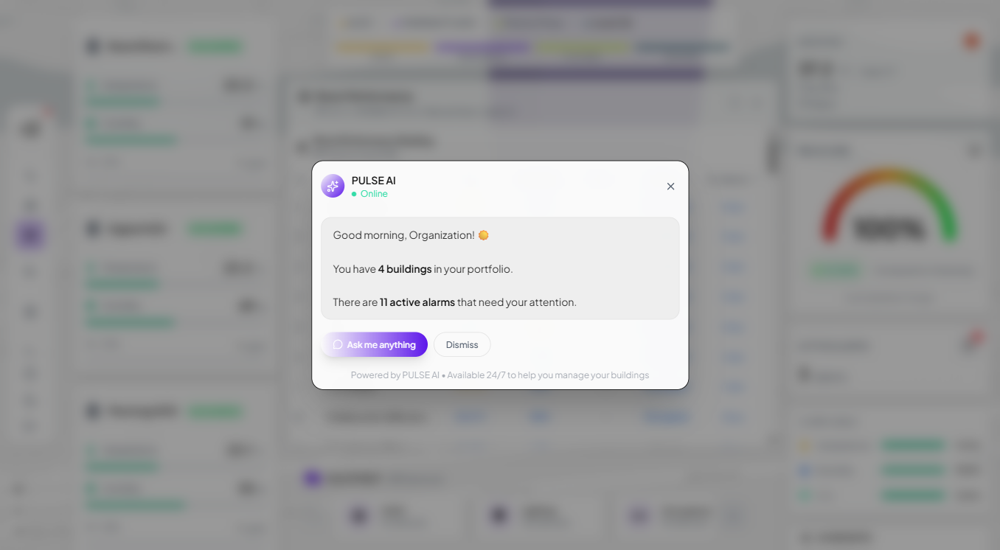

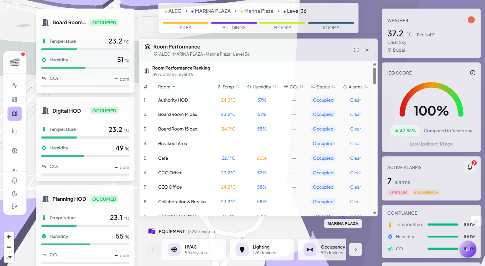

---

## BUG-024 — Portfolio room-details: the X (close) button does not close the panel

- **Severity:** High (user cannot dismiss the panel)
- **Page / URL:** Portfolio / Overview Map — room "ROOM ANALYTICS" details panel
- **Viewport:** Desktop (1440×900)

**Description.** Once a room is selected, the **ROOM ANALYTICS** details panel opens (room name, Live/Historical/Analytics tabs, Temperature/Humidity/Occupancy/Illuminance, Equipment list, device count). The panel header has a **fullscreen (maximise) icon and an X (close) icon**. The maximise button works, but the **X close button does not dismiss the panel**. Verified live: the X button is the topmost element at its position with `pointer-events: auto`, and an actionable Playwright click on `button:has(svg.lucide-x)` **succeeds without error, yet the panel remains open** — i.e. the close **click handler is missing/broken**, not blocked. The user is left unable to close the room-details box.

**Steps to reproduce.**
1. Open **Portfolio / Overview Map** → select a building → a floor → a room (so ROOM ANALYTICS opens).
2. Click the **X** icon at the top-right of the ROOM ANALYTICS panel.
3. Observe the panel stays open.

**Expected.** Clicking X closes the ROOM ANALYTICS details panel.

**Actual.** The X click registers but the panel does not close (broken/missing close handler).

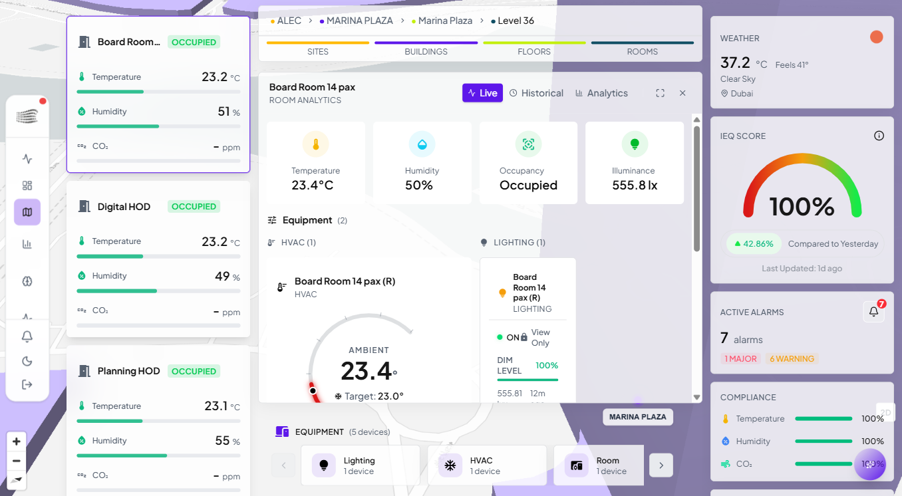

---

## BUG-025 — Inconsistent card hover affordance (purple arrow on Building Performance cards only)

- **Severity:** Low (UI/UX consistency)
- **Page / URL:** Global — Portfolio Dashboard (`/`) Building Performance cards vs Building-detail Floor cards (`/site/#/…`) and other card lists
- **Viewport:** Desktop (1440×900)

**Description.** On the Portfolio Dashboard, hovering a **Building Performance card** reveals a circular right-arrow in the top-right corner that highlights **purple**. The same hover affordance is expected on every card across the app, but other cards render the arrow in a **grey** circle that never turns purple. Confirmed at the CSS level by comparing the computed classes of the two arrow controls:

| Card | Arrow-circle classes | Hover result |
|------|----------------------|--------------|
| Building Performance (dashboard) | `w-7 h-7 rounded-full bg-black/50 … text-white **hover:bg-purple/80 hover:border-purple** transition-colors` | Circle turns **purple** ✅ |
| Floor card (building detail) | `w-6 h-6 rounded-full **bg-surface-container-highest text-secondary** opacity-0 group-hover:opacity-100 …` | Only fades in; **stays grey — no `hover:bg-purple`** ❌ |

The Floor-card arrow (and other card arrows) lack the `hover:bg-purple` / `hover:border-purple` treatment and a smaller size (`w-6 h-6` vs `w-7 h-7`), so the hover cue is visually inconsistent across the product.

**Steps to reproduce.**
1. On the Portfolio Dashboard, hover a **Building Performance** card → note the top-right arrow circle highlights **purple**.
2. Open a building detail (`/site/#/…`) and hover a **Floor** card → the top-right arrow circle stays **grey**.

**Expected.** All card hover-arrows share the same purple highlight affordance for a consistent interaction language.

**Actual.** Only Building Performance cards use the purple hover arrow; other cards use a grey circle.

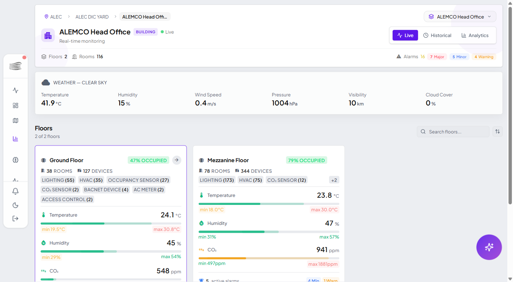

---

## BUG-026 — Duplicate / mis-rendered AI chat launcher on the Portfolio (Overview Map) page

- **Severity:** Medium (UI rendering; chat still functions)
- **Page / URL:** Portfolio / Overview Map — `/overview-map` (vs Home Dashboard `/` and other dashboards)
- **Viewport:** Desktop (1440×900 / 1484×820)

**Description.** The app exposes the AI chatbot through two distinct controls: the embedded **n8n "PULSE AI Chatbot" widget** (a ~64 px round toggle) and an app-shell **"Talk to My Building" launcher** (a 48 px purple-gradient `lucide-sparkles` button). On the **Home Dashboard** (and other dashboards) only the **n8n widget toggle renders** (64 px, visible, working). On the **Portfolio / Overview Map** page the rendering is inconsistent:

| Control | Home Dashboard | Overview Map |
|---------|----------------|--------------|
| n8n "PULSE AI Chatbot" toggle | **visible, 64 px** ✅ | **present but 0×0 (collapsed/hidden)** ❌ |
| App "Talk to My Building" sparkles launcher | **not present** | **visible, 48 px** ❌ |

Because both chat entry points mount on `/overview-map` and the n8n widget collapses to **0×0** while the app launcher appears, the corner shows a **mismatched / duplicated launcher**, and during the n8n widget's load the two **overlap as two purple circles** (as captured by the reporter). The launcher logo therefore "does not render as expected" on the Portfolio page, unlike every other dashboard.

**Steps to reproduce.**
1. On the **Home Dashboard** note a **single** purple chat launcher bottom-right (the n8n widget) — works as expected.
2. Navigate to **Portfolio / Overview Map** (`/overview-map`).
3. Observe the bottom-right launcher: a different/duplicate purple sparkles button appears, with the n8n widget toggle collapsed (and the two briefly overlapping during load).

**Expected.** A single, consistent AI chat launcher renders on every dashboard (the same control, same size/logo).

**Actual.** On `/overview-map` the n8n toggle is 0×0 and a separate app sparkles launcher renders — inconsistent with, and visually duplicating, the launcher seen on other pages.

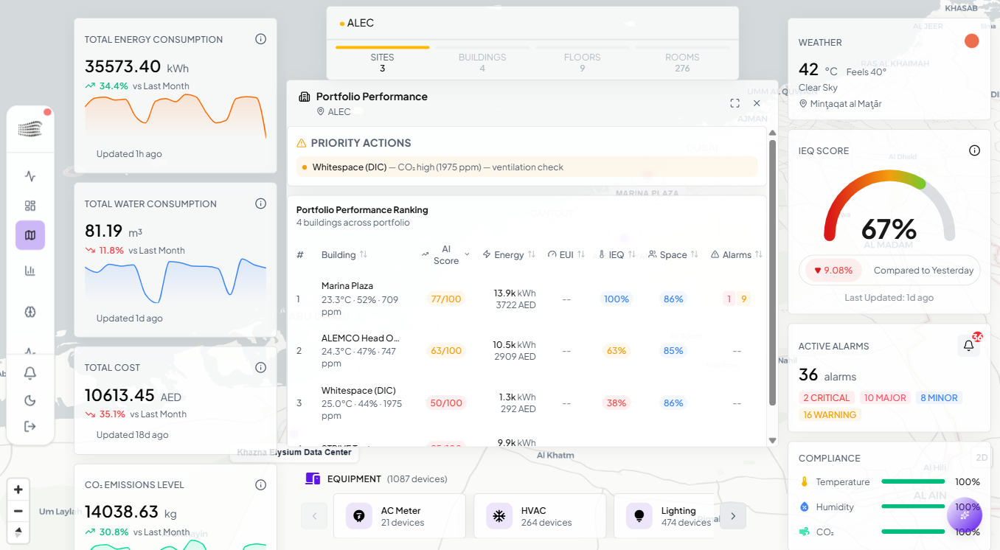

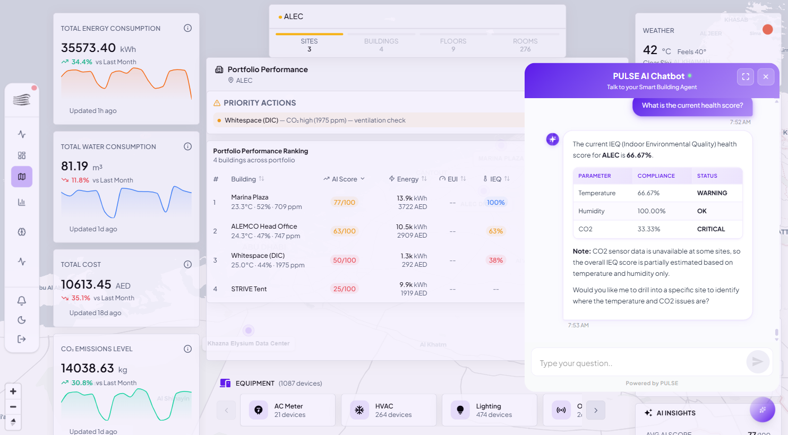

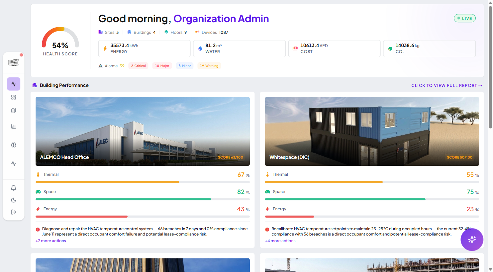

---

## BUG-027 — Inconsistent / non-functional device cards in the ROOM ANALYTICS panel

- **Severity:** Medium (interaction + consistency; controls look actionable but aren't)
- **Page / URL:** Portfolio / Overview Map — room **ROOM ANALYTICS** panel (e.g. Z2-Sivaramakrishnan)
- **Viewport:** Desktop (1440×900)
- **Related:** BUG-023 (room cards / overlay interception)

**Description.** Inside the open ROOM ANALYTICS panel for a room, the device sub-cards (HVAC, Lighting L1/L2, Sensors) present **three different and partly broken** hover/click affordances. Verified at the DOM level:

| Card | Hover border | Purple arrow | Clickable markup | Click works? |
|------|:---:|:---:|:---:|:---:|
| **HVAC** (`…border-0 … border-primary-border`, `cursor:auto`, no onClick) | ❌ no `hover:border` | ✅ shows purple circle arrow | ❌ not clickable | ❌ |
| **Lighting L1/L2** (`…cursor-pointer … hover:border-purple`, onClick present) | ✅ purple border on hover | ✅ | ✅ looks clickable | ❌ click does nothing |
| **Sensors** (`…hover:border-purple cursor-pointer`, onClick present) | ✅ purple border on hover | — | ✅ looks clickable | ❌ click does nothing |

So the **HVAC card** shows a purple right-arrow (implying it is actionable) yet has **no hover-border highlight and is not clickable** (`border-0`, `cursor:auto`, no handler). The **Lighting and Sensors cards** *do* highlight a purple border on hover and present a pointer cursor (so they look clickable), but **clicking them has no effect** — a live click on the L1 Lighting card opened no device detail and left the panel unchanged (dead handler). The three card types are mutually inconsistent and none actually navigate to the device.

**Steps to reproduce.**
1. Open **Portfolio / Overview Map** → drill into a building → floor → room (so ROOM ANALYTICS opens).
2. Hover the **HVAC** card — only the purple arrow highlights; the card border does **not** highlight and the card is **not** clickable.
3. Hover the **Lighting** (L1/L2) and **Sensors** cards — the border **does** highlight (purple), but **clicking them does nothing**.

**Expected.** All device cards share one consistent affordance: a hover-border highlight **and** a working click that opens the device's detail.

**Actual.** HVAC = arrow only, no border, not clickable; Lighting/Sensors = border highlights but click is dead. Inconsistent and non-functional.

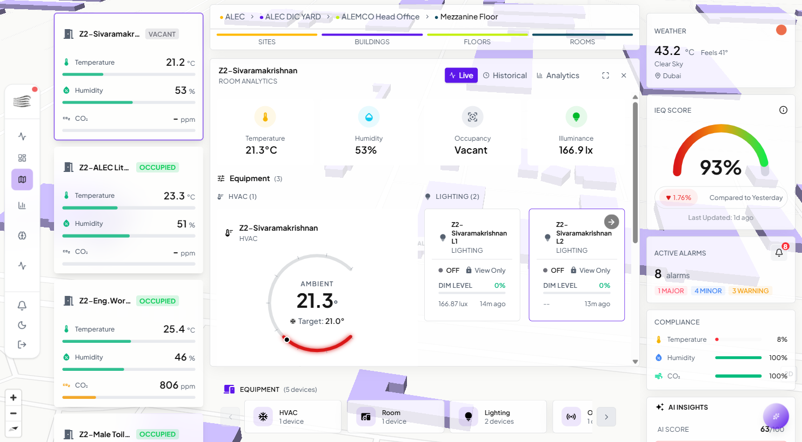

---

## BUG-028 — ALEC organization page takes ~15–19 s to load (client-side aggregation)

- **Severity:** High (performance — primary navigation)
- **Page / URL:** ALEC Organization page — `/home/legacy/` (reached via the **ALEC** breadcrumb from any building/floor/room detail page)
- **Viewport:** Desktop (1440×900)

**Description.** From a detail page (building / floor / room), clicking the **ALEC** breadcrumb to return to the organization page navigates to `/home/legacy/`, but the page displays a **skeleton loading state for ~15–19 seconds** before the organization content (ORGANIZATION IEQ Score, Sites/Buildings/Floors/Rooms counters, Site Listing, map) renders. Measured live, click → content-visible:

| Run | Time to ALEC org content |
|-----|--------------------------|
| 1 | **18,638 ms** (~18.6 s) |
| 2 | **15,234 ms** (~15.2 s) |

The route URL changes to `/home/legacy/` in **~489 ms** and the document `load` event fires in **185 ms**, so the long delay is **not** the page document — it is the **client-side organization aggregation** (rolling up 3 sites · 4 buildings · 9 floors · 276 rooms · 1,087 devices) fetching/rendering. The Performance Resource Timing API shows no single >800 ms same-origin call, pointing to a **chained API waterfall and/or heavy client-side processing** rather than one slow request. This is well over a reasonable interactive budget (< 5 s) and produces a long blank/skeleton wait on a core navigation.

**Steps to reproduce.**
1. Open any building / floor / room detail page (e.g. a `/site/#/…` page).
2. Click the **ALEC** breadcrumb (top-left) to go to the organization page.
3. Time how long the skeleton shows before the org content (Site Listing / IEQ / counters) renders.

**Expected.** The ALEC org page renders content within a few seconds (< 5 s), ideally with progressive loading.

**Actual.** Skeleton shows for **~15–19 s** before content appears (document loads in 185 ms; the delay is client-side data aggregation/render).

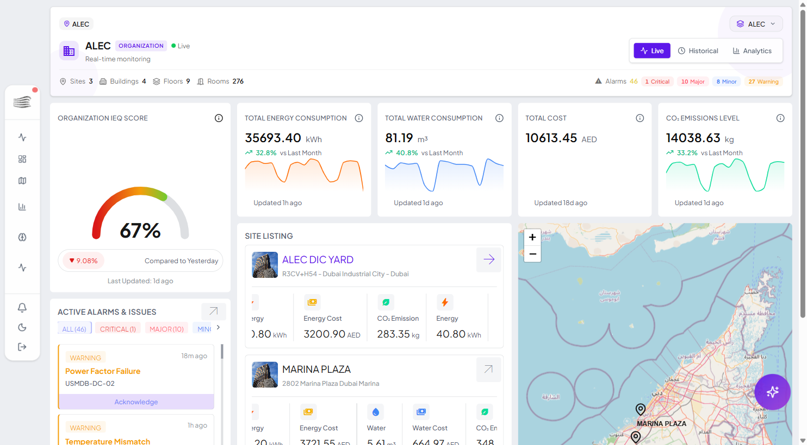

---

## BUG-029 — Alarm Details popup header misalignment (badge overlaps the close button)

- **Severity:** Low (UI/UX alignment)
- **Page / URL:** Building detail (`/site/#/…`) → Floor card → **Alarm Details** popup
- **Viewport:** Desktop (1440×900)

**Description.** On a building detail page, hovering a **Floor** card reveals its active-alarm summary; clicking **"N active alarms"** opens an **Alarm Details** popup. The popup **header is misaligned**: the right-hand **"N ALARMS" count badge overlaps the X (close) button**, and the elements are not vertically centred. Measured live (Ground Floor, "11 ALARMS"):

| Element | Position (x, y, w) | Vertical centre |
|---------|--------------------|-----------------|
| Title "Alarm Details" | 562, 135, 115 | y = 149 |
| "11 ALARMS" badge | 885, 145, 89 (right edge **974**) | y = **158** |
| X close button | 966, 139, 16 (left edge **966**) | y = **147** |

The badge's right edge (**974 px**) is **past** the close button's left edge (**966 px**) — an **~8 px overlap** — and the badge centre (158) sits **~9–11 px below** the title (149) and the X (147). The badge uses `ml-auto` (push-right) which collides with the dialog's absolutely-positioned top-right close control, so they overlap and the close target is partly obscured.

**Steps to reproduce.**
1. Open a building detail page (`/site/#/…`, e.g. ALEMCO Head Office).
2. On a Floor card, click **"N active alarms"** to open the **Alarm Details** popup.
3. Inspect the header: the "N ALARMS" badge overlaps the X close and sits lower than the title.

**Expected.** The header badge, title and X close are vertically centred and do not overlap (badge sits left of the close with adequate spacing).

**Actual.** The "N ALARMS" badge overlaps the X close by ~8 px and is ~9–11 px off-centre.

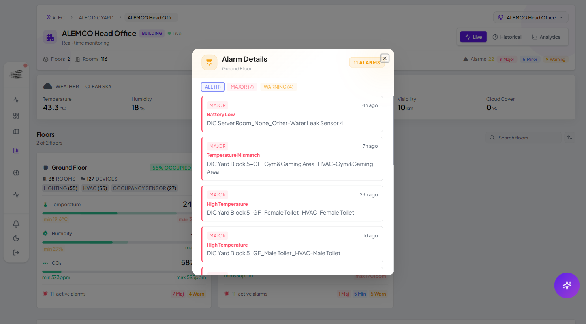

---

## BUG-030 — Unexpected logout on page refresh (refresh-token endpoint returns 500)

- **Severity:** Critical (authentication / session stability)
- **Reported by:** Client — "when logged in and moving between dashboards, after 4–5 page refreshes it automatically logs out; it should not log out."
- **Page / URL:** Any authenticated dashboard on a hard refresh (reproduced on `/` and `/reports`)
- **Environment:** Chrome (also applies to all browsers — it is a backend + client-auth defect, not browser-specific)

**Summary.** Pulse uses a short-lived access token (`jwt_token` / `wt_token_expiration`) plus a long-lived `refresh_token` (`refresh_token_expiration`). On bootstrap, when the access token is expired the app calls the silent-refresh endpoint to mint a new one using the refresh token. **That endpoint is broken** — it returns `500` every time — so the app falls back to a **hard logout**: it clears every auth key from `localStorage` and redirects to `/login`. Because the access token is valid for a while after login, the failure only appears once it lapses, which the user experiences as a random logout "after 4–5 refreshes."

**Root cause (confirmed live).**

1. Forcing the access-token expiry to the past and reloading reproduces the logout 100% of the time: the page lands on `/login/` and **all tokens (`jwt_token`, `refresh_token`, `wt_token_expiration`, `tb_jwt_token`, …) are cleared**.
2. The triggering call is `POST https://test.be.alt-pulse.com/api/user/refresh`, which returns:
   - **Status:** `500 Internal Server Error`
   - **Body:** `{"error":"Organization is not defined"}`
3. The request body carries the **correct, unexpired refresh token** (decoded payload contains `organizationId`, `organizationIds`, `roleSlug: organization-admin`, `exp` far in the future) — so the failure is **server-side**, not a malformed/expired token.
4. Probing the endpoint directly **6 consecutive times** returned `500 {"error":"Organization is not defined"}` on **all 6** — the refresh path is **deterministically broken, not flaky**.

**Two defects, one symptom:**

- **Primary (backend):** `POST /api/user/refresh` throws `"Organization is not defined"` and 500s for a valid refresh token — silent token refresh never succeeds.
- **Secondary (frontend):** on a failed/500 refresh the client immediately **purges all tokens and force-logs-out**, instead of retrying or preserving the session — so a server hiccup becomes a hard logout with no warning.

**Steps to reproduce.**
1. Log in and use the app normally, moving between dashboards.
2. Keep the session open / keep refreshing until the access token's lifetime lapses (repro shortcut: set `wt_token_expiration` to a past timestamp in `localStorage`).
3. Refresh the page (F5).
4. **Observed:** the app calls `/api/user/refresh` → `500 {"error":"Organization is not defined"}` → all tokens cleared → redirected to `/login`.
5. **Expected:** the refresh token (still valid) is exchanged for a new access token and the user **stays logged in** on the same page.

**Impact.** Every authenticated user is force-logged-out the moment their access token expires, regardless of the still-valid refresh token — losing unsaved context and breaking the "stay signed in" expectation. High visibility and easily hit during normal multi-dashboard use.

**Evidence (verbatim).** Request: `POST /api/user/refresh` · body `{"refreshToken":"eyJ…A_6xvZAlaY"}` (valid). Response: `500` · `{"error":"Organization is not defined"}`. Direct probe: 6/6 → `500`.

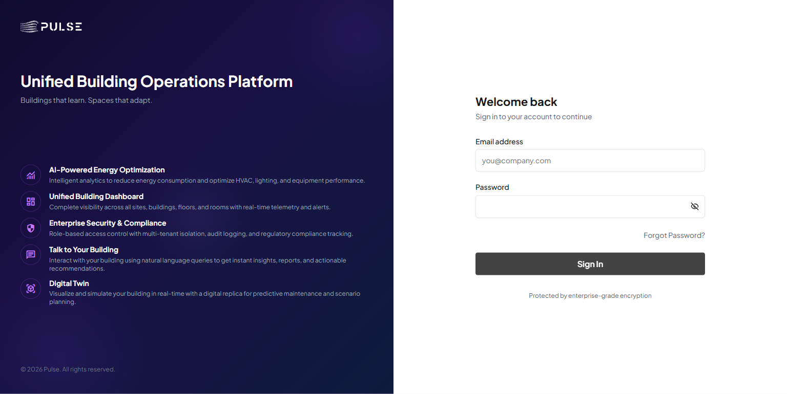

---

## BUG-031 — Map zoom +/− buttons are dead (covered by the EQUIPMENT legend bar)

- **Severity:** Medium (core map interaction broken; mouse-wheel zoom still works as a workaround)
- **Reported by:** Client — "clicking + and − does nothing; clicking/double-clicking instead highlights the EQUIPMENT icon and the device (AC Meter) icon."
- **Page / URL:** `/overview-map`
- **Environment:** Chrome (layout/stacking defect — applies to all browsers)

**Summary.** The portfolio map (MapLibre GL) renders its **zoom-in / zoom-out / compass** controls in the **bottom-left** corner. The **EQUIPMENT legend bar** is a full-width fixed panel pinned to the bottom that **overlaps that same corner** and sits far higher in the stacking order, so it **intercepts every pointer click** meant for the zoom buttons. The buttons therefore appear non-functional, and because the click actually lands on the equipment bar, the **EQUIPMENT / device chips (AC Meter, HVAC, …) get highlighted/selected** instead — exactly the reported behaviour.

**Root cause (measured live).**

| Element | Selector / class | z-index | Rect (x, y, w, h) |
|---------|------------------|---------|-------------------|
| Zoom-in button | `.maplibregl-ctrl-zoom-in` | (cluster `z: 2`) | 10, 673, 29, 29 |
| Zoom-out button | `.maplibregl-ctrl-zoom-out` | (cluster `z: 2`) | 10, 702, 29, 29 |
| Compass button | `.maplibregl-ctrl-compass` | (cluster `z: 2`) | 10, 731, 29, 29 |
| **EQUIPMENT bar (overlay)** | `fixed bottom-0 left-0 right-[calc(320px+0.5rem)] z-[101] pointer-events-auto` | **101** | **0, 652, 1208, 118** |

The equipment bar (top edge `y = 652`, `z-index 101`) fully covers the zoom cluster (`y = 673–760`, `z-index 2`). `document.elementFromPoint()` at the centre of **all three** buttons returns the `z-[101]` equipment bar (`topReceivesClick: false` for each). A **programmatic** `.click()` on the zoom-in button — which bypasses pointer hit-testing — **does zoom** (the 3 site markers spread from `(938,326),(470,604),(970,238)` to `(1099,278),(37,939),(1133,128)`), proving the control works and the only problem is the overlay swallowing real clicks.

**Steps to reproduce.**
1. Open `/overview-map` and dismiss the auto-opening PULSE AI modal.
2. Click the **+** or **−** button at the bottom-left of the map.
3. **Observed:** the map does not zoom; clicking/double-clicking instead highlights the EQUIPMENT bar and a device chip (e.g. AC Meter).
4. **Expected:** the map zooms in/out (and the compass resets north).

**Impact.** The primary map zoom affordance is unusable via its buttons, and the misdirected clicks trigger unrelated equipment selections — confusing and looks broken. This is the **same overlay-interception class as BUG-023** (the `z-[101] pointer-events-auto` bottom panel), here specifically disabling the map controls.

**Suggested fix.** Raise the MapLibre control container above the equipment bar (e.g. `z-index` ≥ `z-[102]`), or stop the equipment bar from covering the bottom-left controls (add left padding / `pointer-events-none` on its empty region, or reposition the zoom cluster to the top-left or above the bar).

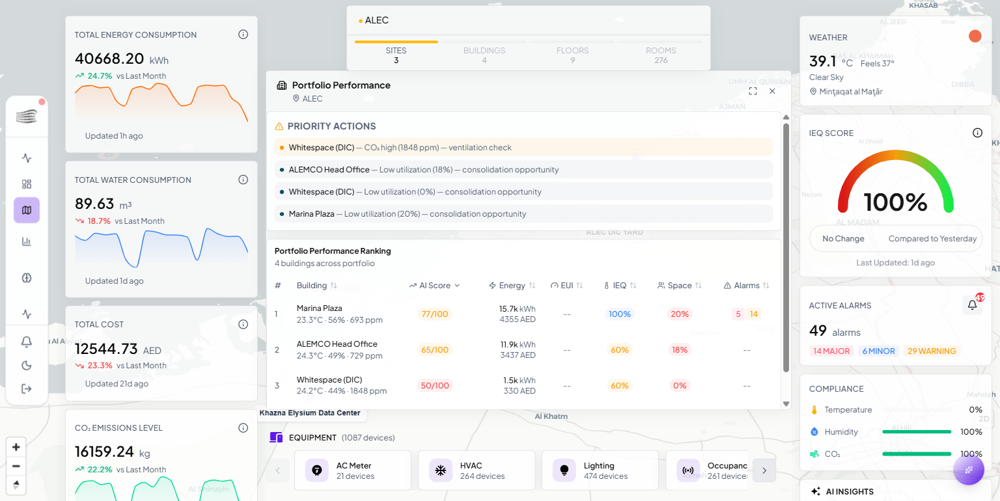

---

## BUG-032 — Building Performance cards fluctuate/jitter on hover (whole row resizes)

- **Severity:** Medium (UI/UX stability)
- **Reported by:** Client (screen recording) — "on the home page, moving the cursor onto a Building Performance widget expands it, but it is not stable — all the Building Performance cards keep fluctuating."
- **Page / URL:** Home / Portfolio Dashboard (`/`)
- **Environment:** Chrome (CSS layout behaviour — applies to all browsers)

**Summary.** Each Building Performance card reveals an extra details panel on hover using a CSS grid expand (`grid grid-rows-[0fr] group-hover:grid-rows-[1fr] transition-[grid-template-rows] duration-500`), which grows the card from **470 px to 699 px** tall. The four cards live in a single **`items-stretch` row**, so when one card expands the row stretches and **all four cards resize to match**. Every time the cursor enters, leaves, or crosses between cards, the **entire row (and all content below it) jumps by ~229 px**, animated over 500 ms — so sweeping the cursor over the widget produces continuous, overlapping expand/collapse animations that read as flickering / instability.

**Root cause (measured live).**

| Cursor state | Card 0 | Card 1 | Card 2 | Card 3 |
|--------------|--------|--------|--------|--------|
| Nothing hovered | 470 | 470 | 470 | 470 |
| **Any one card hovered** | **699** | **699** | **699** | **699** |

- Expanding element: `grid grid-rows-[0fr] group-hover:grid-rows-[1fr] transition-[grid-template-rows] duration-500 ease-in-out` (revealed details panel ≈ **+229 px**).
- The hovered card is stable while the cursor is held still (no self-oscillation), but because the **whole row stretches together**, every hover transition resizes **all four cards** and pushes the rest of the dashboard down by ~229 px. During cursor movement across the row these 500 ms animations overlap and never settle — the visible "fluctuation."

**Steps to reproduce.**
1. Open the Home / Portfolio Dashboard.
2. Move the cursor across the Building Performance cards (hover one, then slide to the next).
3. **Observed:** each hover expands the card and **stretches all four cards** (+229 px); moving between cards makes the whole row and the content below jump/jitter continuously.
4. **Expected:** hovering a card reveals its details **without** resizing the sibling cards or shifting the rest of the page — a stable, contained expand.

**Impact.** The primary dashboard widget feels unstable and janky on hover, and the ~229 px layout shift moves everything below the row each time — a noticeable polish/UX defect on the most-viewed page.

**Suggested fix.** Reveal the details as an **overlay** (e.g. `position: absolute` within the card) so the card footprint doesn't change, or set the row to `items-start` and reserve the expanded height so siblings don't stretch — i.e. avoid letting one card's hover drive the shared row height.

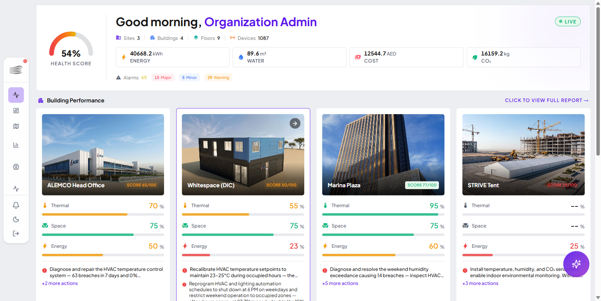

---

## BUG-033 — Fire Alarm card shows 1 device but the drill-down has 0 (phantom count)

- **Severity:** Medium (data integrity — misleading count on a core inventory page)
- **Reported by:** Client (screenshots) — "Fire Alarm card shows 1 device, but clicking it shows 0."
- **Page / URL:** Asset Management (`/asset-management`) → **Fire Alarm** category → detail
- **Environment:** Chrome (data/aggregation defect — not browser-specific)

**Summary.** In the Asset Management inventory, the **Fire Alarm** card (under *Security & Safety Systems*) displays **"1 device · 100% · 1 online"** with a green status bar. Clicking it opens the Fire Alarm detail, which reads **"Fire Alarm · EQUIPMENT · 0 devices in ALEC"**, **"ALL FIRE ALARM DEVICES (0)"**, **"0 of 0 devices"**, and **"No devices found."** The summary count (1) and the drill-down (0) contradict each other.

**Root cause (confirmed live against the backend).**

1. The authoritative ThingsBoard device-type registry `GET /api/device/types` (200 OK) lists **30 real device types** (e.g. `3ph gateway`, `ACREL AC METERS`, `CCTV`, `Suprema`, `NFC Reader`, `Temperature Sensor`, `Milesight AQI`, `default`, …) and contains **no "Fire Alarm" type whatsoever** — so there is genuinely **0** Fire Alarm devices in the tenant. The detail page (0 devices) is therefore correct; the **card count of 1 is the bug**.
2. The Fire Alarm bucket is **intermittent**. Across repeated loads in this session it did **not** appear at all: *Security & Safety* showed **`2 types · 24 devices`** (Access Control 14 + CCTV 10 = 24), and the numbers reconcile with the org total (`1063` BMS + `24` security = **1087**, matching the header "1087 devices").
3. In the client's capture the same section showed **`3 types · 25 devices`** (adding Fire Alarm = 1), **yet the org total still read 1087** (it would have to be 1088) — a clear internal inconsistency confirming the extra Fire Alarm device is a **phantom**, not a real asset.

**Conclusion.** "Fire Alarm" is a front-end category in the app's fixed Security & Safety taxonomy that has **no backing device type or device** in the data source. It occasionally renders with a phantom count of **1** (an aggregation/mapping artifact), so the card badge (1) disagrees with the device-listing query (0) and inflates the category/total counts.

**Steps to reproduce.**
1. Open `/asset-management` and find the **Fire Alarm** card under *Security & Safety Systems* (appears intermittently).
2. Note it shows **1 device · 100% · 1 online**.
3. Click the card.
4. **Observed:** the detail shows **0 devices · "No devices found."**
5. **Expected:** the card count matches the drill-down — if there are 0 Fire Alarm devices, the card should show 0 (or not render), and category/org totals should reconcile.

**Impact.** A core inventory page reports a device that does not exist, and the phantom inflates the Security category and breaks the device-count arithmetic (25 vs the reconciled 24 against a 1087 total). Erodes trust in the asset counts.

**Evidence.** Client screenshots: Fire Alarm card (`1 device · 100% · 1 online`) vs. its detail (`0 devices in ALEC · No devices found`). Backend: `GET /api/device/types` → 200 with **no Fire Alarm type**; live inventory without the phantom shows Security `2 types·24 devices`, total `1087` (reconciled).

---

## BUG-034 — Alarm JSON "copy" button does nothing (no clipboard write)

- **Severity:** Low (broken convenience control; manual select + Ctrl+C is a workaround)
- **Reported by:** Client — "in Alarm Details → Additional Information, the JSON copy icon doesn't copy; only manual mouse-selection copies it."
- **Page / URL:** Any alarm → **Alarm Details** popup → *Additional Information* → **JSON** (reproduced from `/asset-management` → a device card's alarms → an alarm row)
- **Environment:** Chrome (secure `https://` context, clipboard API available)

**Summary.** Opening an alarm and expanding *Additional Information* reveals the alarm payload as JSON with a **copy icon** in the panel header. Clicking that icon **does not place the JSON on the clipboard** — nothing is copied. Selecting the text manually with the mouse and pressing Ctrl+C (the browser's native copy) works, which is why the data is copyable at all.

**Root cause (instrumented live).**

1. The copy control is a real `button` containing an `svg.lucide-copy` icon, sized 24×24 at the top-right of the JSON box. `document.elementFromPoint()` at its centre returns **the button itself** — so it is **not** blocked by an overlay; clicks reach it.
2. The button has **no React `onClick` handler** (`__reactProps$….onClick` is `undefined`).
3. Clipboard APIs were spied (`navigator.clipboard.writeText`, `navigator.clipboard.write`, `document.execCommand`) and the clipboard was seeded with a sentinel (`SENTINEL_BEFORE_CLICK`). After **both** a real pointer click **and** a direct programmatic `button.click()`, **none** of those APIs were invoked (all call-logs empty) and the clipboard **still read `SENTINEL_BEFORE_CLICK`** — i.e. the JSON was never written.

**Conclusion.** The copy icon is decorative — it has no working click handler / clipboard call wired to it, so it is a complete no-op.

**Steps to reproduce.**
1. Open an alarm (e.g. `/asset-management` → a card's *N alarms* → click an alarm row) to open **Alarm Details**.
2. Expand **Additional Information** to show the **JSON**.
3. Click the **copy** icon in the JSON header.
4. Paste elsewhere — **nothing was copied** (clipboard unchanged).
5. **Expected:** the JSON payload is copied to the clipboard (ideally with a "Copied" confirmation).

**Impact.** A visible affordance silently fails; users assume the JSON was copied and paste stale/empty content. Low severity because manual selection still works.

**Suggested fix.** Wire the button's `onClick` to `navigator.clipboard.writeText(json)` (with a `document.execCommand('copy')` fallback for older browsers) and show a transient "Copied" state.

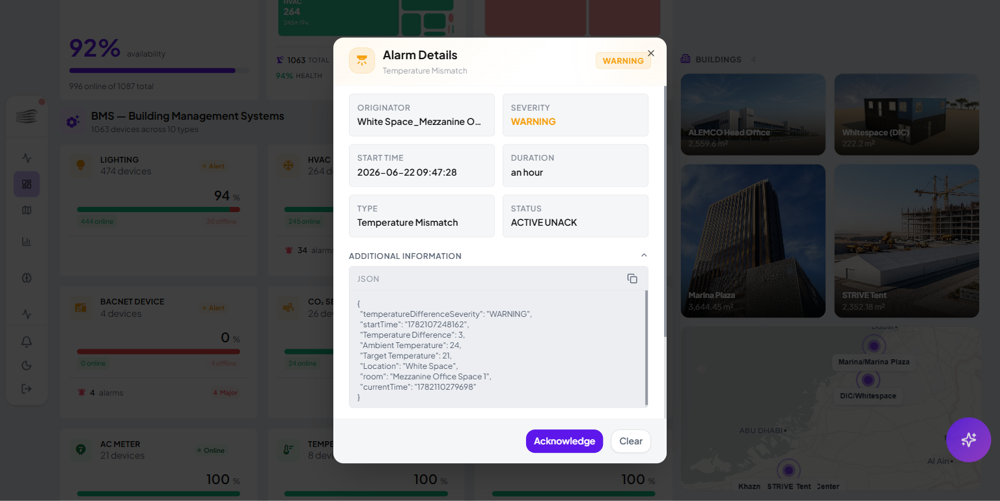

---

## BUG-035 — Notifications panel header is cut off above the viewport at 100% zoom

- **Severity:** Medium (a control — *Mark all as read* — is unreachable at the default browser zoom)
- **Reported by:** Client — "at 100% zoom the Notifications widget header is hidden; at 75% zoom the whole widget incl. header shows."
- **Page / URL:** Any dashboard → sidebar **bell / Notifications** panel (reproduced on `/`)
- **Environment:** Chrome at **100% zoom** (viewport ~770 px tall)

**Summary.** Opening the Notifications panel renders a popover whose **header** (**"Notification (3129)"** + the **Mark all as read** action) is positioned **above the top edge of the window** and is therefore **hidden/clipped** at 100% zoom. The list of notifications is visible, but the header and its control are not, and there is no way to scroll up to them. At 75% zoom — where the CSS viewport is taller — the whole panel including the header is shown.

**Root cause (measured live).**

- The panel is a **Radix UI Popover**. Its positioned wrapper is `position: fixed; left: 0; top: 0; transform: translate(0px, -35px); z-index: 99999`, i.e. it is shifted **upward, partly off-screen**.
- The popover **content is 834 px tall** and is **not constrained to the available viewport height** (no `max-height: var(--radix-popper-available-height)` + internal scroll). On a 100%-zoom viewport of **770 px**, Radix shifts the over-tall panel up to fit its bottom, so the panel top lands at **−75 px**.
- The header is `position: sticky; top: 0`, but sticky only pins **within its scroll container** — and that container's top is already above `y = 0`, so the header is dragged off-screen too. Measured header rect: **y ≈ −74 → −21** (`headerVisible = false`).
- Enlarging the viewport (the 75%-zoom equivalent) moves the header back down toward the visible area (−74 px at 770 → −22 px at 1027 and on toward ≥ 0 on taller screens), matching the client's 100% vs 75% observation.

**Steps to reproduce.**
1. At **100% browser zoom** (short-ish laptop viewport), open a dashboard.
2. Click the **bell / Notifications** control in the sidebar.
3. **Observed:** the panel opens but its **header ("Notification (N)" + Mark all as read) is cut off above the top edge** — not visible and not scrollable into view.
4. Set zoom to **75%** and reopen — the full header is now visible.
5. **Expected:** the panel is clamped to the viewport (`max-height` + internal scroll) so the header is always visible at any zoom, with the notification list scrolling beneath it.

**Impact.** At the **default 100% zoom**, the panel title and the **Mark all as read** action are inaccessible — users must zoom out to use them. Affects the most common zoom level.

**Suggested fix.** Constrain the popover content to `max-height: var(--radix-popper-available-height)` (or a `vh`-based cap), keep the header pinned, and let only the notification **list** scroll — and/or set `collisionPadding`/`avoidCollisions` so Radix never pushes the top off-screen.

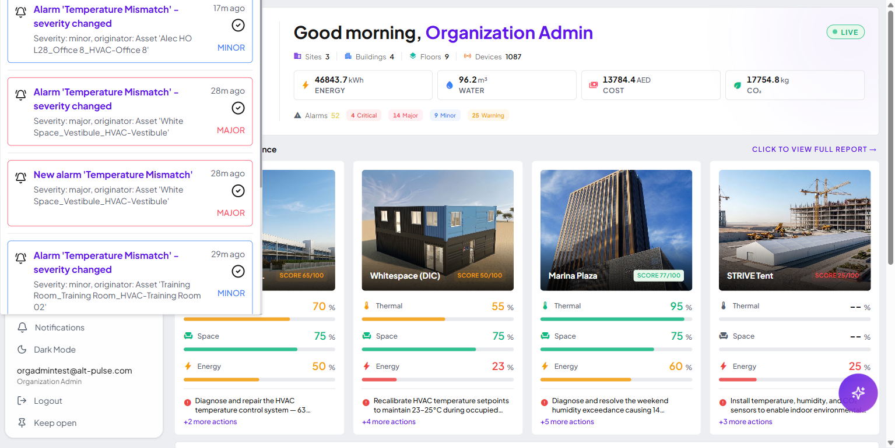

---

## BUG-036 — Inconsistent font brightness/colour (building cards dimmer; light & dark mode)

- **Severity:** Low (visual consistency / contrast)
- **Reported by:** Client — "font brightness differs — the building-card text is a little dim while other cards are brighter; check the whole app and dark mode."
- **Page / URL:** Asset Management (`/asset-management`) building cards vs. other cards (pattern is global)
- **Environment:** Chrome — verified in **both light and dark** mode

**Summary.** Text on the **building cards** (the *Buildings* photo tiles) is rendered **dimmer** than the text on the surrounding cards, and the two use different colour strategies, so brightness is inconsistent across the page. The effect is the same in dark mode.

**Root cause (measured live).**

| Element | Colour token | Computed colour | Notes |
|---------|--------------|-----------------|-------|
| Building card **title** ("ALEMCO Head Office") | `text-white` | `rgb(255,255,255)` | hard-coded white, 12 px; no dark scrim, so contrast varies over the photo |
| Building card **subtitle** ("2,559.6 m²") | `text-white/60` | white at **60% opacity** | deliberately dimmed → the "low brightness" the client sees |
| Other card **title** ("Lighting") | theme token (`text-foreground`) | `lab(2.75)` light / `lab(98.26)` dark | adapts per mode |
| Other card **subtitle** ("474 devices") | `text-secondary` | `rgb(86,97,112)` light / `rgb(142,148,153)` dark | adapts per mode |

- The building-card text is **hard-coded white / white-60**, so it does **not** follow the theme and the subtitle is always dimmer than the adaptive `text-secondary` used elsewhere; over brighter photo regions the white title also drops in contrast because there is **no gradient scrim** behind it.
- App-wide the body text mixes several different "dark" tokens — pure black `lab(2.75)`, near-black `lab(7.78)`, slate `rgb(30,41,59)`, secondary `rgb(86,97,112)`, muted `lab(48.5)` — i.e. multiple brightness levels for nominally similar text.
- In **dark mode** the regular tokens flip (title → near-white `lab(98.26)`, secondary → `rgb(142,148,153)`), but the building subtitle **stays `text-white/60`** — so the inconsistency persists.

**Steps to reproduce.**
1. Open `/asset-management` and compare the **Buildings** card text (title + m² subtitle) with the BMS/Security card text.
2. Note the building text — especially the **60%-opacity subtitle** — looks dimmer/lower-contrast than the crisp text on the other cards.
3. Toggle **dark mode** and compare again — the building subtitle remains dim (`text-white/60`).

**Expected.** Consistent text brightness/contrast: drive card text from the shared theme tokens (or add a dark gradient scrim behind on-image text and raise the subtitle opacity) so building-card text matches the legibility of other cards in both themes.

**Impact.** Cosmetic/legibility inconsistency; the 60%-opacity white subtitle over photos can also be a mild WCAG contrast concern on lighter images.


---

## BUG-037 — Portfolio Performance panel can be closed but never re-opened

- **Severity:** Medium (a primary panel becomes unrecoverable without a full page reload)
- **Reported by:** Client — "on the portfolio dashboard, the Portfolio Performance card closes with its X, but afterwards there is no way to open it again."
- **Page / URL:** Overview Map / portfolio dashboard (`/overview-map`)
- **Environment:** Chrome (applies to all browsers)

**Summary.** The **Portfolio Performance** panel on the overview map has a **Close (X)** control (`button[title="Close"]` with a `lucide-x` icon). Clicking it removes the panel — but the app provides **no affordance to bring it back**. The user is stuck without the panel until they reload the page.

**Root cause / findings (confirmed live).**

1. The panel header contains a **Fullscreen** and a **Close (X)** button; clicking **Close** removes the panel (verified: the `Portfolio Performance` element count drops from **1 → 0**).
2. After closing, a **DOM-wide search of every `button` / `[role=button]` / `a`** for any label/title/aria matching `portfolio | performance | ranking | show panel | open panel` returns **zero** results — there is **no re-open button** in the toolbar, the map controls, or anywhere else.
3. The closed state is **not persisted** — no related `localStorage` key exists — so the panel **reappears only after a full page reload** (`/overview-map` reload restores it). There is no in-app toggle.

**Steps to reproduce.**
1. Open `/overview-map` (dismiss the PULSE AI modal).
2. On the **Portfolio Performance** panel, click the **X** (Close).
3. The panel disappears.
4. Look for any way to re-open it — **there is none**; you must **reload the page** to get it back.
5. **Expected:** a visible toggle/button (or a re-open entry in a menu) restores the panel without reloading.

**Impact.** A key dashboard panel is effectively lost once closed; recovering it requires a full page reload, which is non-obvious and interrupts the session.

**Suggested fix.** Add a persistent toggle to re-open the panel (e.g. a button in the map toolbar / header), and ideally remember the open/closed state per user.

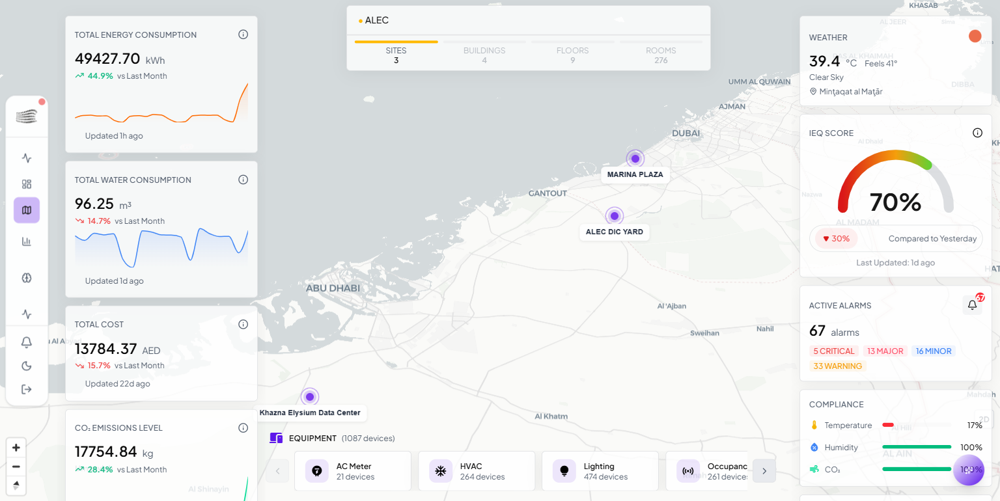

---

## BUG-038 — Performance panel Close (X) is dead once drilled into a sub-level (incl. maximized)

- **Severity:** Medium (the panel can't be closed via X from a drilled-down view; needs back-navigation or reload)
- **Reported by:** Client — "when the Portfolio Performance card is maximized, the X (close) is non-functional; only the minimize/maximize icon works."
- **Page / URL:** Overview Map (`/overview-map`) → Portfolio Performance → drill into Floor / **Room Performance**
- **Environment:** Chrome (applies to all browsers)

**Summary.** The performance panel's **Close (X)** works **only at the top level** (*Portfolio Performance*). Once you drill into a site → building → floor (the panel becomes *Floor Performance* / *Room Performance* — the state in the client's maximized screenshot), the **X does nothing**. The **Exit Fullscreen / maximize** toggle keeps working, which is why it looks like "only minimize/maximize works."

**Root cause / findings (confirmed live).**

| State | Exit Fullscreen / maximize | Close (X) |
|-------|---------------------------|-----------|
| Top-level **Portfolio Performance**, maximized | works | **closes** ✅ |
| Drilled **Room Performance**, maximized | works | **no-op** ❌ |
| Drilled **Room Performance**, restored | works | **no-op** ❌ |
| Back to top **Portfolio Performance** | works | **closes** ✅ |

- In the drilled-down view the **Close button still has an `onClick` handler, is enabled, and is the topmost element** (no overlay), yet clicking it has **no effect** — **two consecutive real clicks** left the panel present, **same title ("Room Performance")** and **same breadcrumb** (`ALEC › ALEC DIC YARD › ALEMCO Head Office › Ground Floor`), with **no close and no back-navigation**.
- Using the panel's **back (chevron)** control to return to the top **Portfolio Performance** level makes the **X close the panel again** — so the close action is **gated to the root level** and is effectively dead at every drilled level.

**Steps to reproduce.**
1. Open `/overview-map`, dismiss the PULSE AI modal, and (optionally) **Maximize** the Portfolio Performance panel.
2. Click a ranking row to drill in: site → building → floor, until the title reads **Floor Performance** / **Room Performance**.
3. Click the **X (Close)**.
4. **Observed:** nothing happens — the panel stays open (only **Exit Fullscreen** works).
5. **Expected:** the X closes the panel from any level.

**Impact.** From any drilled-in view (the common case after exploring a building/floor), the user cannot close the panel via its X; they must first navigate all the way back to the top level (or reload the page).

**Suggested fix.** Make the Close (X) handler always close the panel regardless of drill level (don't gate it on the root state); keep "back" on the chevron only.

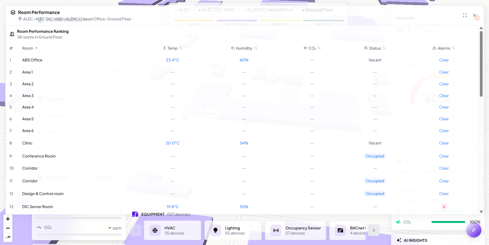

---

## BUG-039 — Hard refresh shows out-of-scope buildings (client-side scoping race)

- **Severity:** High (scope/data-isolation correctness — the view shows buildings the user's scope is meant to hide)
- **Reported by:** Client — "on a hard refresh it shows many sites; on a normal refresh it shows only 4."
- **Page / URL:** Asset Management (`/asset-management`)
- **Environment:** Chrome — hard refresh (Ctrl+Shift+R / cache-bypass cold start) vs normal refresh (F5)

**Summary.** The Asset Management view is scoped to the Organization Admin's **4 buildings / 1087 devices** (ALEMCO Head Office, Whitespace (DIC), Marina Plaza, STRIVE Tent). After a **hard refresh**, the **BUILDINGS** section and the header counts instead show the **full, unscoped set — ~15 buildings / 1115 devices** (BMS `1090`, Security `25`, more alarms), including buildings the scope is meant to hide. A subsequent **normal refresh** returns to the correct 4.

**Root cause (confirmed live against the backend).**

1. **Normal refresh (warm):** measured live — header `1087 devices · 3 sites · 4 buildings`, **BUILDINGS = 4** (the four in-scope buildings). Stable, no flash.
2. **Backend delivers the full set:** `GET /api/hierarchy/tree/scoped` returns the organization with **16 building assets**, and `GET pulse.alec.ae/api/user/assets?type=Building` returns **16** buildings — `Camp-12/Kitchen, Camp-61/Kitchen, DIC/Main, DIC/Whitespace, DIC/Labour Welfare Area, Marina/Marina Plaza, Tent-5, Site Office – Block A…G, STRIVE Tent, ICAD Warehouse/Storage`. So the client **receives all ~16 buildings**; the narrowing to 4 is done **client-side** using `pulse-resourceScope` (org + a sites list) in `localStorage`.
3. **Hard refresh (cold start):** with the JS bundle and in-memory store re-initialised, the BUILDINGS list and counts **render from the full hierarchy response before the client-side scope filter is hydrated/applied**, so the unscoped ~15 buildings and inflated counts appear (matching the client's screenshot). Once the store hydrates (or on the next warm refresh) the filter re-applies and it returns to 4.

**Steps to reproduce.**
1. Open `/asset-management` → note **4 buildings / 1087 devices**.
2. Do a **hard refresh** (Ctrl+Shift+R).
3. **Observed:** the **BUILDINGS** section shows **~15 buildings** and the header/equipment counts jump (`1115 devices`, BMS `1090`, Security `25`) — including out-of-scope buildings (Camp-12/Kitchen, Site Office Block A–G, ICAD Warehouse, …).
4. Do a normal refresh (F5) → back to **4 buildings / 1087 devices**.
5. **Expected:** the same scoped **4 buildings / 1087 devices** on every refresh, hard or soft.

**Impact.** The scope is enforced **only on the client**, so out-of-scope organisation assets are **delivered to the browser and shown** on a hard refresh, with inconsistent device/alarm totals. This is a data-scoping/consistency defect with a privacy/isolation dimension (the scoped-out buildings are exposed in the payload and rendered).

**Suggested fix.** Apply scope **server-side** so `/api/hierarchy/tree/scoped` returns only the in-scope buildings, and/or gate first render until `pulse-resourceScope` is hydrated so the client never paints the unscoped set.

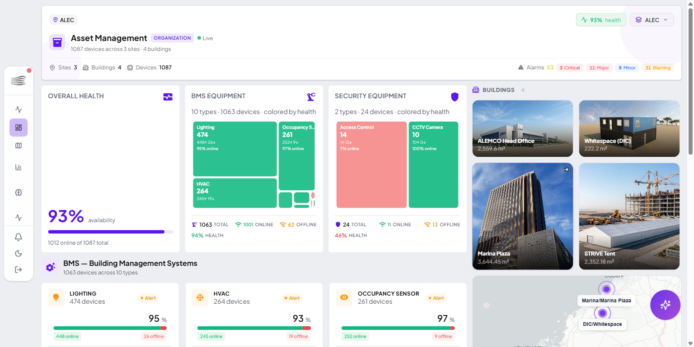

---

## BUG-040 — Alarm "Acknowledge" button persists after acknowledging and flickers on close

- **Severity:** Medium (stale action affordance → redundant failing requests + visible flicker)
- **Reported by:** Client — "after acknowledging an alarm the Acknowledge button should disappear, but it stays; and closing the Alarm Details with X makes the acknowledge buttons flicker."
- **Page / URL:** Overview Map → **Active Alarms** widget → **Alarm Details** popup (`/overview-map`)
- **Environment:** Chrome (applies to all browsers)

**Summary.** From the Active Alarms widget, clicking **Acknowledge** opens the **Alarm Details** popup, which also has an **Acknowledge** button. After acknowledging, the button **should be removed** (the alarm is now ACK), but it **remains visible and enabled**; and when the popup is **closed via X**, the footer buttons **flicker** (the Acknowledge button reappears during the close animation).

**Root cause / findings (confirmed live).**

1. **Acknowledge succeeds but the button stays.** Clicking Acknowledge fires `POST https://pulse.alec.ae/api/alarm/{id}/ack` → **200**. The dialog, however, keeps the **Acknowledge** button present and enabled (status not refreshed to *ACTIVE ACK* in-place). A subsequent Acknowledge on the same alarm fires `POST …/ack` → **400** (already acknowledged) — proof the button should no longer be offered.
2. **Flicker on close (measured).** With an already-acknowledged alarm whose footer correctly showed **`Clear` only**, clicking **X** and sampling each animation frame showed the footer change to **`Acknowledge + Clear`** **while the dialog was fading out** (wrapper `opacity: 0`) — i.e. the **Acknowledge button reappears during the close**, producing the flicker.
3. The Active Alarms list also **re-polls `POST /api/alarmsQuery/find` extremely frequently** (hundreds of calls per session), so dialog open/close re-renders the list and recomputes the row/footer buttons, compounding the flicker.

**Steps to reproduce.**
1. Open `/overview-map` → click the **Active Alarms** bell to open the widget.
2. Click **Acknowledge** on an alarm row → the **Alarm Details** popup opens.
3. Click **Acknowledge** in the popup.
4. **Observed:** the **Acknowledge** button stays (status doesn't refresh to ACK in place); clicking it again returns **400**.
5. Click the **X** to close → the footer **Acknowledge/Clear** buttons **flicker** as the popup fades out.
6. **Expected:** once acknowledged, the Acknowledge button is removed/disabled and the status updates to *ACTIVE ACK*; closing the popup fades out cleanly with no button flicker.

**Impact.** Users can't tell the alarm was acknowledged (the button stays), and re-clicking sends a failing `400`; the close-animation flicker looks broken. Plus the very aggressive alarm-list polling is wasteful.

**Suggested fix.** Drive the footer buttons from the alarm's live status (hide/disable **Acknowledge** when `acknowledged`/`ACK`), update the dialog optimistically on a 200, and freeze the footer state during the close animation (don't recompute as it unmounts). Throttle the `alarmsQuery/find` polling.

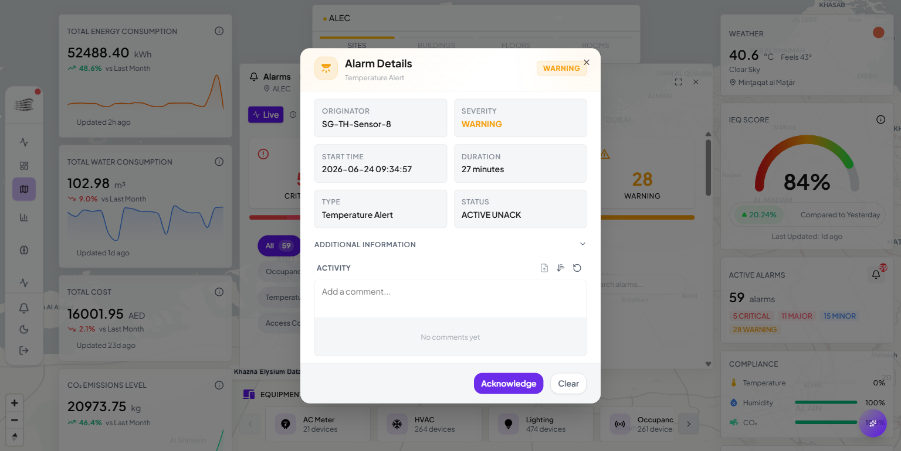

---

## BUG-041 — HVAC airflow diagram: the Ambient card overlaps the SUPPLY header

- **Severity:** Low (visual overlap / partially obscured label on a primary live view)
- **Reported by:** Client — "on the device live page (DIC Mezzanine → Z5-Work Shop → Z5-Work Shop 1) the Ambient card overlays the SUPPLY header; this should be consistent across all floors/rooms/devices."
- **Page / URL:** HVAC device → **Live** real-time monitoring (the FCU airflow diagram)
- **Environment:** Chrome (shared SVG component — applies to all browsers)

**Summary.** The HVAC device "Live" view renders an airflow diagram (**ROOM → COOLING COIL → FAN → SUPPLY**) with a floating **Ambient / Target** summary card in the top-right. That card is positioned so it **overlaps the "SUPPLY" column header label**, and its background paints over the text — partially obscuring it. Because it is a single shared component, the collision occurs on **every** HVAC device, not just the one reported.

**Root cause (measured live).** Reproduced on `L36-MCP04_FREE HOD_HVAC-FREE HOD` (a different device than the client's `Z5-Work Shop 1`):

| Element | Rect (left, top → right, bottom) |
|---------|----------------------------------|
| Floating **Ambient / Target** card (SVG `<g>`) | 1188, 313 → **1463, 392** |
| **"SUPPLY"** column label | **1409, 381** → 1475, 403 |

The two boxes intersect by **~54 px horizontally × ~11 px vertically**, and `document.elementFromPoint()` in the overlap region returns the **card's background `rect`** (`overlapBelongsToCard: true`) — i.e. the card is drawn **on top of** the SUPPLY label. The card uses a fixed top-right position in the diagram rather than being anchored clear of the column headers, so it collides regardless of device/floor/room.

**Steps to reproduce.**
1. Open any HVAC device's **Live** view (Asset Management → HVAC → a device), e.g. the client's path: building → Mezzanine floor → Z5-Work Shop → Z5-Work Shop 1.
2. Look at the top-right of the airflow diagram.
3. **Observed:** the **Ambient / Target** card overlaps and partly covers the **SUPPLY** header label (~54 × 11 px).
4. **Expected:** the card sits clear of the column headers; **SUPPLY** is fully legible. Layout is consistent on every device.

**Impact.** Cosmetic but pervasive — a header label on the primary live-monitoring view is partly obscured on all HVAC devices.

**Suggested fix.** Reposition the Ambient/Target card (move it up/left or into the diagram's header band) or reserve vertical space so it never overlaps the column labels; make the layout responsive to the diagram width so it is consistent across devices.

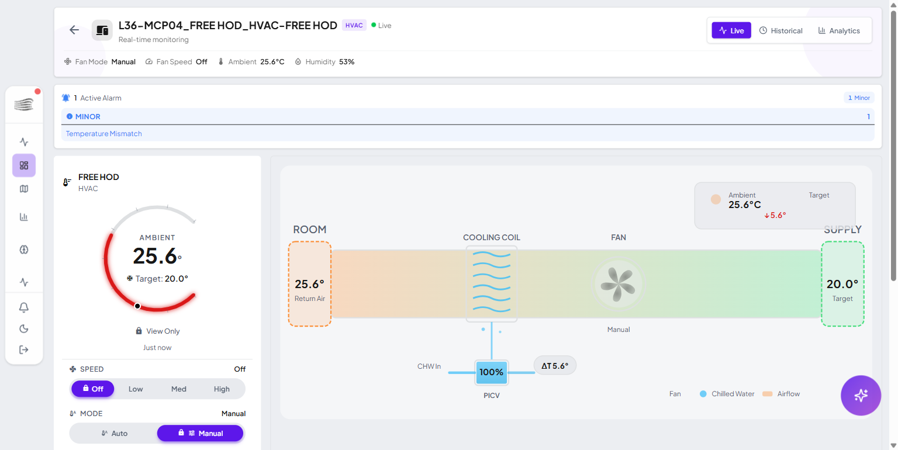

---

## BUG-042 — PULSE AI Chatbot: scrolling the chat scrolls the whole page (scroll chaining)

- **Severity:** Low (UX — the page moves unexpectedly while reading the chat)
- **Reported by:** Client — "when scrolling inside the chatbot, only the chatbot scrollbar should move, but the application's scrollbar scrolls."
- **Page / URL:** Any page with the **PULSE AI Chatbot** open (reproduced on the dashboard `/`)
- **Environment:** Chrome (CSS behaviour — applies to all browsers)

**Summary.** With the PULSE AI Chatbot open, scrolling inside the chat message area does not stay contained to the chat — the **underlying page scrolls** as well. This happens because the chat's scroll container does not stop the scroll from "chaining" to the document when it reaches a boundary.

**Root cause (measured live, before any modification).**

- The chat panel is the n8n widget (`.chat-window`); its scrollable message list is **`.chat-body`** — `scrollHeight 13571` vs `clientHeight 459` (so it is genuinely scrollable).
- `.chat-body` uses the **default `overscroll-behavior: auto`** (computed `overscrollBehaviorY: "auto"`, captured natively). With `auto`, once the inner scroller hits its top/bottom boundary the wheel **chains to the parent/document**.
- The **document is independently scrollable** (`scrollHeight - clientHeight = 486 px`), and the chat opens **pinned to the bottom** of its message list — so any further downward scroll is immediately at the boundary and moves the **page**. (A live wheel over the chat was observed moving the page; precise deltas were noisy because the chat was actively streaming a reply and auto-scrolling.)
- Setting `overscroll-behavior: contain` on `.chat-body` (test override) stops the chaining — confirming the cause.

**Steps to reproduce.**
1. Open the **PULSE AI Chatbot** (bottom-right launcher) on any page that itself scrolls.
2. Move the cursor over the chat message list and scroll (wheel / trackpad).
3. **Observed:** the **page behind the chat scrolls** (its scrollbar moves) instead of only the chat.
4. **Expected:** scrolling inside the chat moves **only** the chat; the page stays put.

**Impact.** Reading or scrolling chat history unexpectedly moves the whole dashboard, which is disorienting — especially since the chat opens at the bottom of a long message list.

**Suggested fix.** Add **`overscroll-behavior: contain`** (or `none`) to the chat scroll container (`.chat-body`) so wheel/touch scroll is trapped inside the chat and never chains to the document.

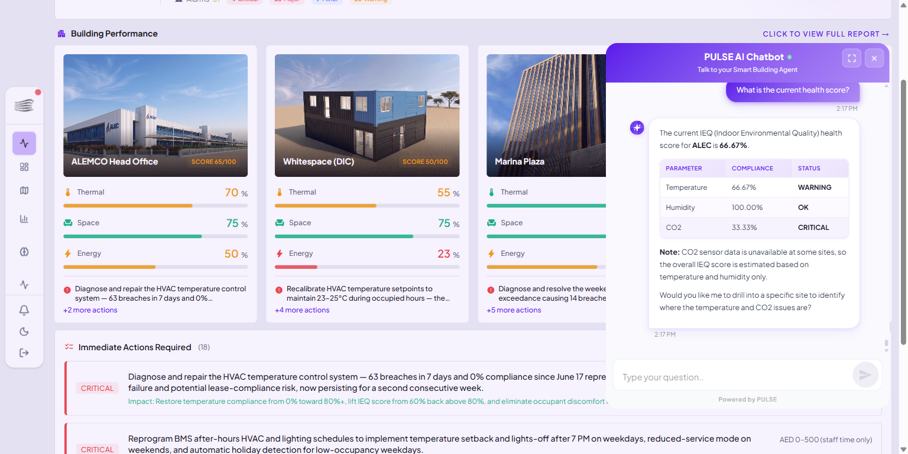

---

## C.3 Integration-pending pages — verified clean (not defects)

All six not-yet-integrated routes were opened live and render a proper **"Integration Pending"** placeholder with **no crash, no framework error**:

| Route | Title | State |
|-------|-------|-------|
| `/compliance` | Compliance & Certification Roadmap | Integration Pending ✅ |
| `/smart-cx` | Automatic / Smart Commissioning | Integration Pending ✅ |
| `/start-stop` | Optimized Start/Stop | Integration Pending ✅ |
| `/maintenance` | Maintenance / Work Orders | Integration Pending ✅ |
| `/maintenance-calendar` | Maintenance Calendar | Integration Pending ✅ |
| `/fdd` | Fault Detection & Diagnosis | Integration Pending ✅ |

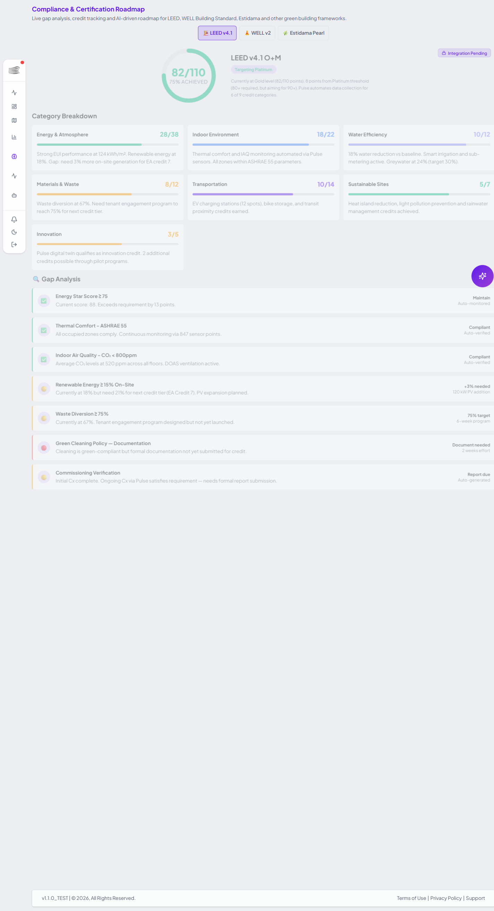

---

# Part D — BMS operational & data-integrity findings (cross-checked vs client QA workbook)

**Source.** Cross-referenced against the client's screenshot-based QA workbook **`Pulse_QA_Complete_v2.xlsx`** (150 manual cases, 20 observed bugs, RBAC matrix). These findings are **building-operations / data-semantic** in nature — they complement the web-application defects in Parts A–C rather than duplicating them. Where I could reach the screen live, I **re-verified the finding on `test.alt-pulse.com`** as Org Admin (column "Live re-verify").

> **De-duplication.** WB-09 (CO₂ encoding) overlaps the placeholder/encoding theme of BUG-007/017; the alarm-storm and device-offline items are net-new operational findings not in Parts A–C. Live counts drift (alarms/telemetry stream continuously), so exact numbers may differ from the workbook capture while the **condition** persists.

## D.1 Findings summary (20)

| ID | Module | Finding | Severity | Live re-verify |
|----|--------|---------|----------|:--------------:|
| WB-01 | Asset → Lighting | Brightness bar shows 264.89 lx on a 0–200 scale → overflow past max | Major | — |
| WB-02 | Asset → Lighting | AI Anomaly Report stuck at "Report not generated yet" with no trigger/ETA | Minor | — |
| WB-03 | Portfolio | ALEC DIC YARD floor node shows "No rooms found" despite 2 building devices | Major | — |
| WB-04 | Alarm/Compliance | Temperature compliance 17% with no alarm escalation surfaced | Major | — |
| WB-05 | Alarm Center | **Power-Factor Failure alarm storm** dominates Most-Frequent (was 2087/2249 ≈ 92.8%) — no suppression | Critical | ✅ pattern confirmed (PF #1 by far) |
| WB-06 | Asset Mgmt | **Access Control 13/14 offline (7%)** — security-critical, no Critical alarm raised | Critical | ✅ confirmed (1↑ / 13↓, 7%) |
| WB-07 | Asset Mgmt | **CCTV 0/10 online (0%)** — full camera blind-spot, no Critical alarm raised | Critical | ✅ confirmed (0↑ / 10↓, 0%) |
| WB-08 | AI Insights | "Integration Pending" on Work Orders / Uptime / Next-Failure with no ETA | Minor | ✅ (badges present) |
| WB-09 | Compliance/Building | CO₂ label renders as "COÂ…" (encoding artefact) | Minor | — |
| WB-10 | Work Orders | PM Compliance 89% (< 90% target) with no auto-alert | Minor | — |
| WB-11 | Maintenance Calendar | "No results" in HVAC-approaching list despite 12 WOs due — module data-sync gap | Major | — |
| WB-12 | Portfolio/Building | Temperature compliance stuck at 17% across views — no auto HVAC remediation | Major | — |
| WB-13 | Smart Commissioning | Functional Performance Testing 81.4% pass / 11 open issues — no sign-off block | Major | — |
| WB-14 | Asset → HVAC | **FCU Runtime 10,801.60 h vs 7,000 h bar cap** — exceeds threshold, no PM WO generated | Major | — |
| WB-15 | Asset → Lighting | Lights OFF yet runtime counters high (354.45 h / 1,095.80 h) — no PM review flag | Minor | — |
| WB-16 | Alarm Center | Historical alarms show **"CLEARED UNACK"** — cleared without acknowledgement (process gap) | Major | — |
| WB-17 | AI Report | "Generated On 11 May 2026" — report 5+ weeks stale | Major | — |
| WB-18 | Profile/Audit | Recent Activity shows "Saved role creation draft" ×8 — events not collapsed | Cosmetic | — |
| WB-19 | Energy Intelligence | Avg Payback Period tile shows "18–30 M" + redundant "Months" label | Minor | — |
| WB-20 | Security | Password may persist in DOM `input.value` with autofill; ensure `autocomplete="current-password"` | Major | — |

**Part D severity:** 3 Critical · 10 Major · 5 Minor · 1 Cosmetic · (1 Security overlaps Major) = **20 findings**.

## D.2 Live-verified critical findings (with evidence)

### WB-06 / WB-07 — Security systems offline (Access Control 7%, CCTV 0%), no Critical alarm

Re-verified live on Asset Management: **Access Control 14 devices → 1 online / 13 offline (7%)** and **CCTV Camera 10 devices → 0 online / 10 offline (0%)**, plus **BACnet 0/4 online (0%)**. These are security-and-safety systems shown only as "Alert" with **no corresponding Critical alarm** in the Alarm Center. Complete CCTV failure and near-total access-control failure should mandate Critical escalation.

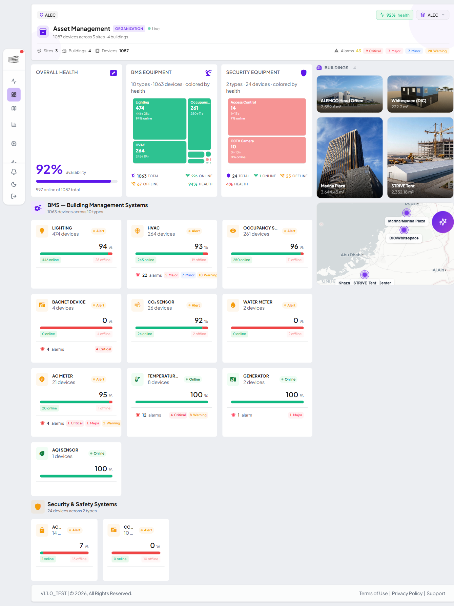

### WB-05 — Power-Factor Failure alarm storm dominates

Re-verified live on Alarm Center → Analytics: **Power-Factor Failure is the #1 Most-Frequent alarm by a wide margin** (e.g. 231 vs the next type at 8), with the top "Most Alarming Devices" being DB-365-Mezzanine / DB-365. A single alarm type dominating the population masks other critical events; the system shows no storm detection, grouping or suppression.

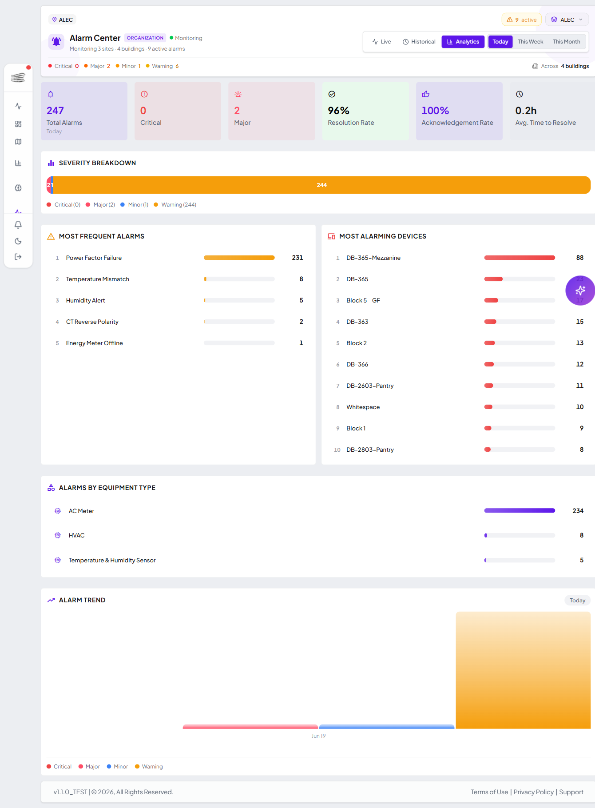

## D.3 RBAC matrix (workbook) vs live verification

The workbook defines a 7-role × 35-permission matrix. My live RBAC pass (Part C) covered **Org Admin** (full) and a **Facility Manager scoped to Marina Plaza**, confirming nav/data scope enforcement **plus** the two High-severity gaps BUG-020 (admin pages reachable by direct URL) and BUG-021 (dashboard KPI scope leak). The matrix's other roles (ESG Manager, Security, Executive, Read-Only, Restricted) are catalogued for future per-role verification; the workbook's expected matrix is a good oracle for that next pass.

---

## Known / Expected states (not defects)

The following modules display an **"Integration Pending"** (or equivalent zero-data) state. Per the development team these are **not yet integrated** and the state is **expected**. They are recorded here for completeness so QA does not re-file them as defects.

| Module | Route | Observed state |
|--------|-------|----------------|
| AI Insights | `/ai-insights` | Integration Pending |
| Energy Intelligence | `/energy-savings` | Integration Pending (badge on category panel) |
| Compliance | `/compliance` | Integration Pending |
| Work Orders | `/maintenance` | Integration Pending |
| Maintenance Calendar | `/maintenance-calendar` | Integration Pending |
| Fault Detection | `/fdd` | Integration Pending |
| Smart Commissioning | `/smart-cx` | Integration Pending |
| HVAC Optimization | `/start-stop` | Integration Pending |

### Other observations (informational — verify with product/data team)

- **Asset Management transient empty-state:** an early mobile capture showed "Scanning asset fleet… / 0 online of 0 total / 0 devices across 0 types", while the desktop capture loaded a full inventory (1,000+ devices). This appears to be a **slow first paint**, not data loss — worth confirming the loading skeleton vs. true empty handling.
- **Different metric labels across views (informational):** Dashboard shows **68 % HEALTH SCORE**, Asset Management shows **92 % availability**, and the AI Chatbot reports a **75.4 % IEQ Score**. These are *different metrics* (health vs. device availability vs. IEQ); the shared "score" wording is potentially confusing and is worth confirming. **Note:** this is distinct from **BUG-015** (Part C), where the AI Chat reports a conflicting value for the *same* metric — *Overall Health Score* 82.5 % vs Dashboard 68 %.
- **Decorative blur elements** positioned with negative offsets (e.g. `absolute -right-24 -top-24 … rounded-full`) extend beyond the viewport on several pages. They are visually clipped and **do not** create a horizontal scrollbar (`horizontalOverflowPx = 0` on all pages), so they are **not** treated as overflow defects.

---

## Appendix — coverage & artefacts

- **Pages audited (19):** Portfolio Dashboard, Asset Management, Overview Map, AI Reports, AI Insights, AI Chat, Energy Intelligence, Compliance, Work Orders, Maintenance Calendar, Fault Detection, Smart Commissioning, HVAC Optimization, Profile, Theme Settings, Users, Roles, Permission Matrix, Workflow.
- **Screenshots:** 38 full-page captures (desktop + mobile per page) in [QA/bug-report/screenshots/](screenshots/).
- **Raw diagnostics:** [QA/bug-report/audit.json](audit.json) (per-page overflow, overlap %, broken images, placeholders, zero-state markers, `h1`/`main` counts).
- **Pages that rendered clean** (landmark note BUG-007 aside): AI Chat, Profile, Theme Settings, Workflow.
- **Audit tooling (re-runnable):** [scripts/audit.cjs](../../scripts/audit.cjs), [scripts/analyze-audit.cjs](../../scripts/analyze-audit.cjs).
